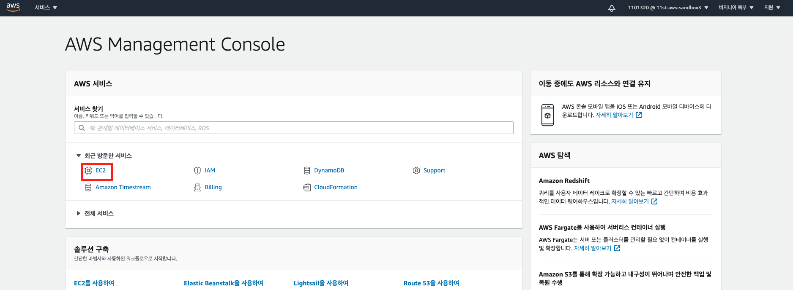
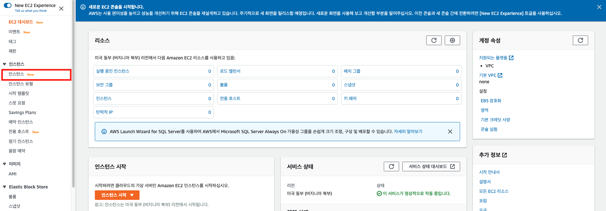
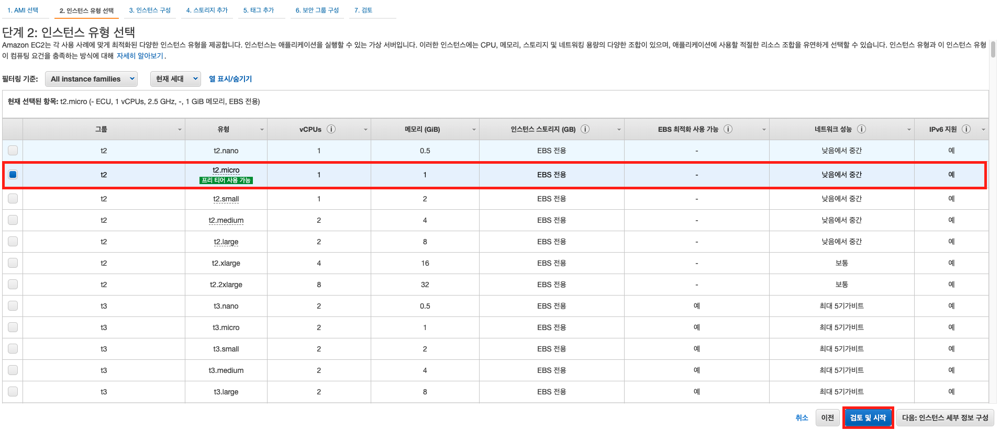
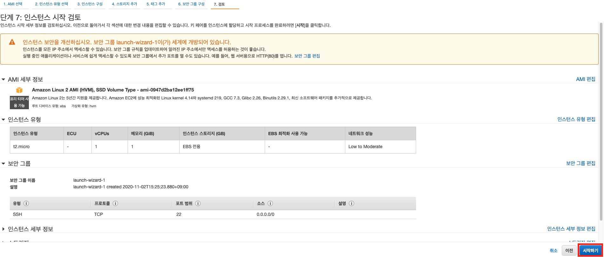
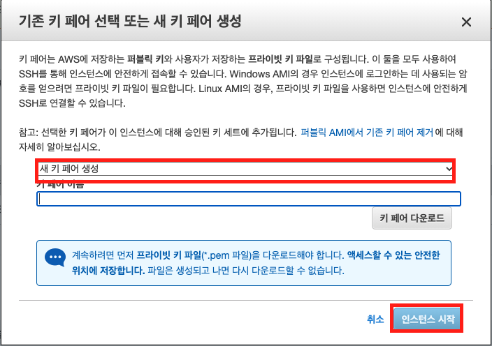

# EC2 생성하기


> AWS의 컴퓨팅 서비스 "EC2" 인스턴스를 생성하는 것에 대한 문서입니다.


## 개요

정말이지 `AWS` 쓰고 싶지 않았는데.. 회사에서 쓰게 되다 보니 자연스레 쓰게 되었다. `GCP`처럼 이런 저런 얘기하는 것이 아닌 간략하게 해당 정보만 기록할 생각이다. `EC2`는 `AWS`의 컴퓨팅 서비스이다. `GCP`의 `GCE`와 같다.


## EC2 인스턴스 생성하기 



"AWS Console"에 접속한다. 여기서 "EC2"를 클릭한다.



다음 화면에서, "인스턴스"를 클릭한다.


다음 화면에서 "인스턴스 시작"을 클릭한다.


원하는 "AMI"를 선택한다. `AMI`는 서버 인스턴스의 운영체제라고 생각하면 된다. 나는 프리티어에서 지원되는 `Amazon Linux 2 AMI`를 선택했다.



인스턴스 유형을 선택한다. 쉽게 서버 스펙이라고 생각하면 된다. 나는 프리티어에서 지원되는 `t2.micro`를 선택했다. (기본적으로 선택되어 있다.) 그 후 "검토 및 시작"을 클릭한다.



"시작하기"를 클릭한다.



그럼 위의 팝업 창이 나오는데, 클릭해서, "새 키 페어 생성"을 선택한다. 적절한 "키 페어 이름"을 설정한 후, "키 페어 다운로드"를 클릭하여, `*.pem` 파일을 다운로드 한다. 그 후, "인스턴스 시작"을 클릭한다.


그럼 다음 화면처럼 `EC2` 콘솔에서 인스턴스가 생성된 것을 확인할 수 있다.


## EC2 인스턴스 접속하기

이제 생성한 인스턴스를 접속해보자. 먼저, 이전 절에서 다운로드 했던 `pem` 파일을 적절한 곳에 옮긴다. 그 후, 같은 디렉토리에, 다음과 같이 쉘 스크립트를 만들어준다.

```bash
#! /bin/bash

# Give pem permission 400
chmod 400 <pem 파일 이름>

# ssh connect
ssh -i "<pem 파일 이름>" <ec2 인스턴스 public dns>
```

> 참고!
> 
> public DNS 정보는, 인스턴스 목록에서, 해당 인스턴스 우 클릭 > 연결을 클릭한다. 그 후, 나오는 페이지에서, SSH 클라이언트 를 클릭하면, 확인할 수 있다.

나의 경우, 디렉토리 밑에 이렇게 구성한다.

```
|- pem 파일
|- connect.sh
```

그래서 `connect.sh`만 실행시키면, 서버에 접속할 수 있다.

```bash
source connect.sh
Last login: Mon Nov  2 06:43:27 2020 from 175.126.171.166

       __|  __|_  )
       _|  (     /   Amazon Linux 2 AMI
      ___|\___|___|

https://aws.amazon.com/amazon-linux-2/
[ec2-user@ip-172-31-85-161 ~]$
```

## 참고

- [AWS 공식 가이드](https://aws.amazon.com/ko/ec2/getting-started/)
- [victolee님의 EC2 인스턴스 생성하기](https://victorydntmd.tistory.com/61)