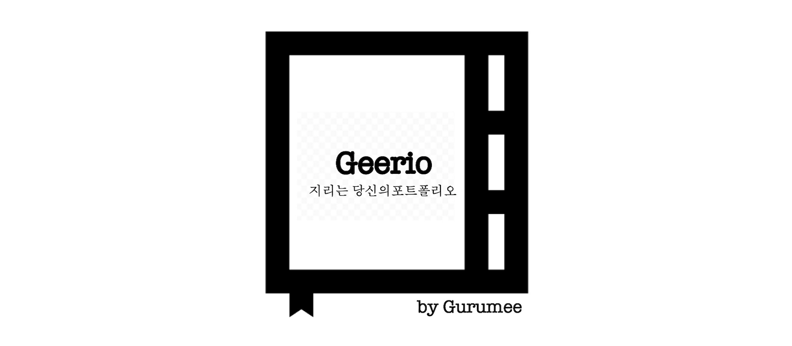
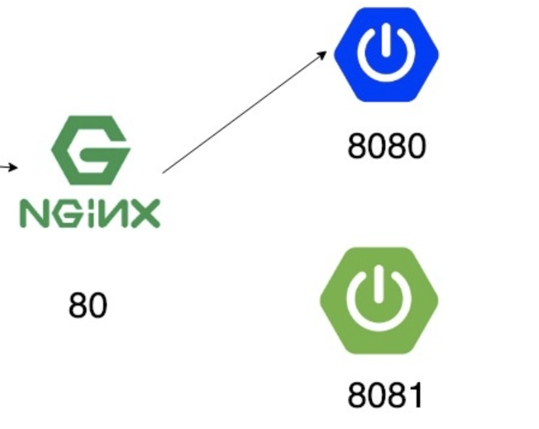

# 지리오 서비스 구축기 (2) 쉘 스크립트로 CI/CD 구축하기



> 실제 개인 서비스 "지리오"를 만들면서 한 일을 기록한 문서입니다. 쉘 스크립트를 통해서 배포를 보다 손쉽게 하는 방법에 대해서 다루고 있습니다. 

## 테스트, 빌드, 배포 작업을 간단히 알아보자.

개발자 코드를 작업한 후 서버에 배포할 때 어떤 일련의 과정을 거친다. 이 과정을 `지리오` 서비스에 맞춰서 정리하자면, 다음과 같다.

1. 서버에 접속한다.
2. `Github`에서 코드를 받아온다. 
3. **마스터 브랜치**로 변경한다. 
4. `Gradle`을 통해서 코드를 테스트 및 빌드한다. 
5. 빌드한 결과물을 토대로 도커 이미지를 만들고, 개인 도커 레지스트리에 올린다.
6. 개인 도커 레지스트리에서 저장된 이미지를 받아온다.
7. 6번에서 받은 이미지를 토대로 다시 배포를 한다.

이는, 코드가 수정되고 마스터 브랜치에 코드가 합쳐지면, 계속 일어나야 하는 작업들이다. 이러한 과정을 `CI/CD`라고 한다. 보통 `CI`는 개발자의 추가/수정된 코드에 대한 테스트 및 코드 병합 과정을 말하고, `CD`는 `CI`의 결과물을 릴리즈하고, 서버에 배포하는 작업을 말한다. 이 문서에서는 `CI` 과정 중 테스트 코드에 대한 자동화, 그 후 `CD`과정을 자동화 한다. 

요약하자면, 서버에 접속하는 1번을 제외한, 2~4번 작업은 `CI`, 5~7번 과정은 `CD`라고 볼 수 있다. 이 문서는 위 과정 중 서버에서 코드 테스트 및 배포 작업을 자동화하는 것에 대해서 다루고 있다.

> 참고!
> 보통, 코드가 병합되는 브랜치는 "master"보다는 "release"로 따로 이름을 지어 관리합니다. 자세한 내용은 "깃 플로우 전략"을 참고하세요. 개인적으로는, [아틀라시안의 공식 문서](https://www.atlassian.com/git/tutorials/comparing-workflows/gitflow-workflow)를 추천합니다. 국내 문서로는 우아한 형제들 외 여러 기업들의 기술 블로그에서 확인하실 수 있습니다.
> 
> 또한, 아래 절부터는 "이미 서버에 접속해 있다고 가정"합니다.


## 쉘 스크립트로 테스트 자동화하기 

먼저, 병합된 코드를 받아오고, 릴리즈 브랜치, 여기서는 "master" 브랜치로 변경하고 테스트 및 빌드 작업을 한다. 그 전에 서버에 접속했을 때 어떤 구조인지 확인한다. 나의 구조는 다음과 같다.

```bash
# 현재 위치 확인
$ pwd
# 서버에서 프로젝트 루트 디렉토리.
/home/gurumee/geerio-app

# 루트 디렉토리에 저장된 파일들.
$ ls -al
drwxr-xr-x  3 gurumee gurumee 4096 Oct  4 12:03 .
drwxr-xr-x 11 gurumee gurumee 4096 Oct  4 12:03 ..
-rw-r--r--  1 gurumee gurumee  555 Oct  4 12:03 docker-compose.yml
drwxr-xr-x  2 gurumee gurumee 4096 Oct  4 08:53 nginx
```

이제 이 프로젝트에서, 소스 코드를 받아오고, 릴리즈 브랜치로 변경한 후, 테스트 및 빌드 과정을 진행할 것이다. 다음과 터미널에서 같은 파일을 하나 만든다.

```bash
$ touch ci.sh  
```

그 후, `vim`으로 `ci.sh`를 열어 다음과 같이 수정한다.

> 참고!
> vim을 잘 모른다면, 그냥 터미널에 "vim ci.sh"를 입력 해주세요. 그 다음 "i"를 누르고 아래 내용을 복사, 그 후 "esc"를 누르고 ":wq!"를 누르면 됩니다.

```sh
#!/bin/bash

# 소스 코드를 저장하는 레포지토리 경로
GIT=https://github.com/gurumee92/geerio.git
# 해당 소스코드로 만들어질 디렉토리 경로
DIR=geerio
# 릴리즈 브랜치
BRANCH=master

echo "---1. CI---"
echo "1-1. source code clone"

# 레포지토리에서 복사
git clone ${GIT}

# 프로젝트로 이동
cd ${DIR}

# 릴리즈 브랜치로 변경
git checkout ${BRANCH}

echo "1-2. source code test"
# "gradlew"에 실행 권한 주기
chmod +x ./gradlew
# 소스 코드 빌드
./gradlew build

# 루트 디렉토리로 복귀
cd ../
echo "-------------"
```

설명이 필요한 부분은 주석을 달아 놓았다. 이 스크립트는 다음 내용을 순서에 따라 진행한다.

1. 레포지토리에서 코드를 복사한다.
2. 릴리즈 브랜치로 변경한다.
3. 빌드 도구를 이용해 테스트 및 빌드한다.

`Gradle`의 "build" 명령어는 테스트와, 빌드 작업을 순서대로 진행한다. 자 이제 터미널에 다음을 입력해보자.

> 참고!
> 이 때 서버에는 java 8이 설치되어 있어야 합니다. gradlew 실행 파일이 있기 때문에, Gradle은 설치되어 있지 않아도 괜찮습니다.

```bash
# ci.sh 실행 권한 주기
$ chmod +x ci.sh

# 실행
$ source ci.sh
# 스크립트 결과
---1. CI---
1-1. source code clone
fatal: destination path 'geerio' already exists and is not an empty directory.
Already on 'master'
Your branch is up-to-date with 'origin/master'.
1-2. source code test
./gradlew: 39: cd: can't cd to "./
Downloading https://services.gradle.org/distributions/gradle-6.4.1-all.zip
.............10%..............20%..............30%..............40%..............50%..............60%..............70%..............80%..............90%.............100%

Welcome to Gradle 6.4.1!

Here are the highlights of this release:
 - Support for building, testing and running Java Modules
 - Precompiled script plugins for Groovy DSL
 - Single dependency lock file per project

For more details see https://docs.gradle.org/6.4.1/release-notes.html

Starting a Gradle Daemon (subsequent builds will be faster)

> Task :test
2020-10-10 12:54:24.370  INFO 6997 --- [extShutdownHook] o.s.s.concurrent.ThreadPoolTaskExecutor  : Shutting down ExecutorService 'applicationTaskExecutor'
2020-10-10 12:54:24.380  INFO 6997 --- [extShutdownHook] j.LocalContainerEntityManagerFactoryBean : Closing JPA EntityManagerFactory for persistence unit 'default'
2020-10-10 12:54:24.381  INFO 6997 --- [extShutdownHook] .SchemaDropperImpl$DelayedDropActionImpl : HHH000477: Starting delayed evictData of schema as part of SessionFactory shut-down'
2020-10-10 12:54:24.396  INFO 6997 --- [extShutdownHook] o.s.s.concurrent.ThreadPoolTaskExecutor  : Shutting down ExecutorService 'applicationTaskExecutor'
2020-10-10 12:54:24.401  INFO 6997 --- [extShutdownHook] com.zaxxer.hikari.HikariDataSource       : HikariPool-1 - Shutdown initiated...
2020-10-10 12:54:24.416  INFO 6997 --- [extShutdownHook] com.zaxxer.hikari.HikariDataSource       : HikariPool-1 - Shutdown completed.

BUILD SUCCESSFUL in 1m 55s
5 actionable tasks: 5 executed
-------------
```

좋아 됐다. 이제 `jar`파일이 빌드되어 있나 확인해보자.

```bash
$ ls -al geerio/build/libs/
total 37148
drwxr-xr-x 2 gurumee gurumee     4096 Oct 10 12:54 .
drwxr-xr-x 9 gurumee gurumee     4096 Oct 10 12:54 ..
-rw-r--r-- 1 gurumee gurumee 38028211 Oct 10 12:54 geerio-0.0.1-SNAPSHOT.jar
```

이제 다음 단계로 넘어간다.


## 쉘 스크립트로 앱 빌드 자동화하기

이제 이 빌드 결과물을 가지고 도커 이미지를 만든 후, 도커 레지스트리에 푸쉬한다. 이 과정은 "Continuous Delivery" 작업으로써, `CI`가 완료된 코드를 토대로, 만든 결과물을 레지스트리/레포지토리에 올려놓는다. 나의 경우는 테스트가 통과된 코드 결과물로써, 도커 이미지를 만들고 해당 이미지를 레지스트리에 올려 놓는 것이다. 바로 시작하자. `ci.sh`에 있는 위치와 동일하게 프로젝트 루트에서 `cd-1.sh`를 만든다.

```bash
$ touch cd-1.sh  
```

또한, `vim`을 이용하여, 해당 코드를 넣는다.

```bash
#!/bin/bash

IMAGE=gcr.io/geerio/geerio-app
DIR=geerio

# 2. CD (1) Docker image build && deploy
echo "---2. CD(1)---"
echo "2-1. GET NEW VERSION"

# GCR 에서 태그 목록 가져옴.
INPUT=$(gcloud container images list-tags --format='get(tags)' ${IMAGE})
echo "input: ${INPUT}"

# 태그 목록 중 첫 원소 가져옴.
TAGS=$(echo ${INPUT[0]} | awk -F ' ' '{print $1}')
echo "tags: ${TAGS}"

# 태그 형식 version;latest 에서 version 분리
LATEST_TAG=$(echo ${TAGS[0]} | awk -F ';' '{print $1}')
echo "old version: ${LATEST_TAG}"

# 새로운 태그 생성
ADD=0.1
VERSION=$(echo "${LATEST_TAG} $ADD" | awk '{print $1 + $2}')
NEW_VERSION=$(printf "%.2g\n" "${VERSION}")
echo "new versoin: ${NEW_VERSION}"

# 이미지 생성 후 빌드 및 레지스트리 푸쉬
echo "2-2. docker image build and push"
docker build --tag ${IMAGE}:${NEW_VERSION} ./${DIR}
docker push ${IMAGE}:${NEW_VERSION}

# latest 태깅 후 레지스트리 푸쉬
docker tag ${IMAGE}:${NEW_VERSION} ${IMAGE}:latest
docker push ${IMAGE}:latest
echo "--------------"
```

필요한 내용은 주석에 달아놓았다. 간단하게 요약하자면, 다음과 같다.

1. 레지스트리에서 태그 목록을 가져온다.
2. 태그 목록 중 최근 태그를 가져온다.
3. 최근 태그 +0.1을 한 새로운 태그를 만든다.
4. 새로운 태그 기준으로 이미지를 빌드 및 컨테이너 레지스트리에 푸시한다.
5. 새로운 태그를 latest로 태깅하여, 레지스트리에 푸시한다.

이제 실제 스크립트를 실행한다.

```bash
# cd-1.sh 실행 권한 주기
$ chmod +x cd-1.sh

# 실행
$ source cd-1.sh
---2. CD(1)---
2-1. GET NEW VERSION
input: 0.2;latest
0.1
tags: 0.2;latest
old version: 0.2
new versoin: 0.3
2-2. docker image build and push
Sending build context to Docker daemon   52.9MB
Step 1/4 : FROM openjdk:8-jdk-alpine
8-jdk-alpine: Pulling from library/openjdk
e7c96db7181b: Already exists 
f910a506b6cb: Already exists 
c2274a1a0e27: Already exists 
Digest: sha256:94792824df2df33402f201713f932b58cb9de94a0cd524164a0f2283343547b3
Status: Downloaded newer image for openjdk:8-jdk-alpine
 ---> a3562aa0b991
Step 2/4 : COPY ./build/libs/*.jar /application.jar
 ---> 6e29aa42a07d
Step 3/4 : EXPOSE 8080
 ---> Running in d361f7fac9ff
Removing intermediate container d361f7fac9ff
 ---> ece4597e9b56
Step 4/4 : ENTRYPOINT ["java", "-jar", "/application.jar"]
 ---> Running in 44685b55ed3d
Removing intermediate container 44685b55ed3d
 ---> c12daa1af507
Successfully built c12daa1af507
Successfully tagged gcr.io/geerio/geerio-app:0.3
The push refers to repository [gcr.io/geerio/geerio-app]
23d9251ea567: Layer already exists 
ceaf9e1ebef5: Layer already exists 
9b9b7f3d56a0: Layer already exists 
f1b5933fe4b5: Layer already exists 
0.3: digest: sha256:3384812f2b77c8ec32651bba454a3f78169ba700641bdbfa1ebda4056c33735a size: 1159
The push refers to repository [gcr.io/geerio/geerio-app]
23d9251ea567: Layer already exists 
ceaf9e1ebef5: Layer already exists 
9b9b7f3d56a0: Layer already exists 
f1b5933fe4b5: Layer already exists 
latest: digest: sha256:3384812f2b77c8ec32651bba454a3f78169ba700641bdbfa1ebda4056c33735a size: 1159
--------------
```

이제 레지스트리에 가보면 새로운 버전인 0.3이 추가된 것을 확인할 수 있다.


## 쉘 스크립트로 앱 배포 자동화하기

이제 빌드한 이미지를 레지스트리에서 다시 내려받은 후, 서비스를 재 배포해보자. 이 작업은 "Continuous Deploy" 작업으로, 실제 서비스를 재 배포하는 과정이다. 나는 `nginx`로 2개의 스프링 부트 앱을 연결시켰기 때문에 서비스 중단 없이 배포가 가능하다.



이 구조는 `이동욱`님의 책 "스프링 부트와 AWS로 혼자 구현하는 웹 서비스"를 고대로 가져왔다. 자 이제 서비스를 배포해보자. `cd-2.sh`를 생성한다.

```bash
$ touch cd-2.sh
```

이제 `vim`을 이용해서, 파일을 다음과 같이 수정한다.

```bash
#!/bin/bash

IMAGE=gcr.io/geerio/geerio-app
DIR=geerio

# 3. CD (2) 배포
echo "3-1. get release version"

# 도커 레지스트리에서 최근 태그 가져옴.
INPUT=$(gcloud container images list-tags --format='get(tags)' ${IMAGE})
TAGS=$(echo ${INPUT} | awk -F ' ' '{print $1}')
echo $TAGS

TAG=$(echo ${TAGS} | awk -F ';' '{print $1}')
echo "release: ${TAG}"

# 최근 태그의 이미지 풀
echo "3-2. docker image pull"
docker pull ${IMAGE}:${TAG}

# 도커 컴포즈 최근 태그로 변경
echo "3-2. docker-compose update"
cat > docker-compose.yml << EOF 
version: '3.1'
services:
    nginx: 
        container_name: nginx
        volumes: 
            - ./nginx/nginx.conf:/etc/nginx/nginx.conf
        image: "nginx:alpine" 
        ports: 
            - 80:80
            - 443:443
    app-01: 
        container_name: app-01
        image: "gcr.io/geerio/geerio-app:${TAG}" 
        ports: 
            - 8080:8080
    app-02: 
        container_name: app-02
        image: "gcr.io/geerio/geerio-app:${TAG}" 
        ports: 
            - 8081:8080
EOF

# 서비스 디플로이
echo "3-3. apps deploy!!"
docker-compose stop app-01
docker-compose up --build -d app-01
docker-compose start app-01

docker-compose stop app-02
docker-compose up --build -d app-02
docker-compose start app-02
echo "--------------"
```

여기서 하는 작업은 다음과 같다.

1. 도커 레지스트리에서 해당 이지미의 최신 태그를 가져온다.
2. 해당 태그로 이미지를 풀한다.
3. 해당 태그로 `docker-compose.yml`을 업데이트 한다.
4. 서비스를 하나씩 내리고, 이미지를 기준으로 다시 만든 후, 재 시작한다.

이제 파일을 실행해보자.

```bash
# cd-2.sh 실행 권한 주기
$ chmod +x cd-2.sh

# 실행
$ source cd-2.sh
3-1. get release version
0.3;latest
release: 0.3
3-2. docker image pull
0.3: Pulling from geerio/geerio-app
Digest: sha256:84d475236e7d613bb252ab6ec503d691ac9a0b6569f11c1f5bc5dca90d2e4b54
Status: Image is up to date for gcr.io/geerio/geerio-app:0.3
gcr.io/geerio/geerio-app:0.2
3-2. docker-compose update
3-3. apps deploy!!
Stopping app-01 ... done
Recreating app-01 ... done
Starting app-01 ... done
Stopping app-02 ... done
Recreating app-02 ... done
Starting app-02 ... done
```


## 쉘 스크립트 하나로 엮기

이제 하나의 쉘 스크립트로 만들어보겠다. 이를 `deploy.sh`라 한다. 시작하자.

```bash
$ touch deploy.sh
```

그 후 `vim`으로 파일을 열어 다음과 같이 수정한다.

```bash
#!/bin/bash
source ci.sh && source cd-1.sh && source cd-2.sh

DIR=geerio
IMAGE=gcr.io/geerio/geerio-app

echo "4. clear resources"
rm -rf ${DIR}
```

실제, 여태까지 작업을 파이프라인으로 연결하여, 하나라도 실패하면, 다음 작업은 진행하지 않게 한다. 이제 이 스크립트를 실행해보자.

> 참고! 
> 이 때, 클론한 geeio 프로젝트를 삭제해줍니다. "명령어: rm -rf geerio" 
> 왜냐하면, ci 작업 때, 복사했던 디렉토리와 겹칠 수 있기 때문입니다.

```bash
# deploy.sh 실행 권한 주기
$ chmod +x deploy.sh

# 실행
$ source deploy.sh
...
```

이렇게 해서 `CI/CD 구축` 첫 단계인 쉘 스크립트로 자동화하기가 끝났다. 이제 다른 작업들이 남았다. 내가 원하는 브랜치에 코드 병합이 일어나면, 서버에 접속하여, 이 `deploy.sh`를 실행하는 일이 남았다.