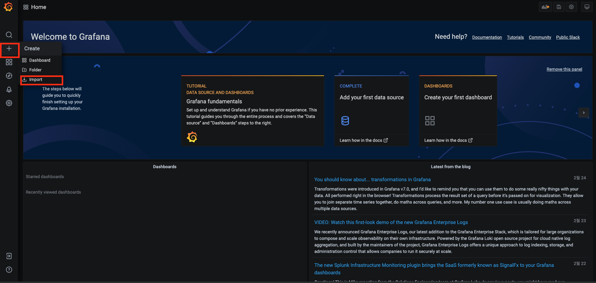
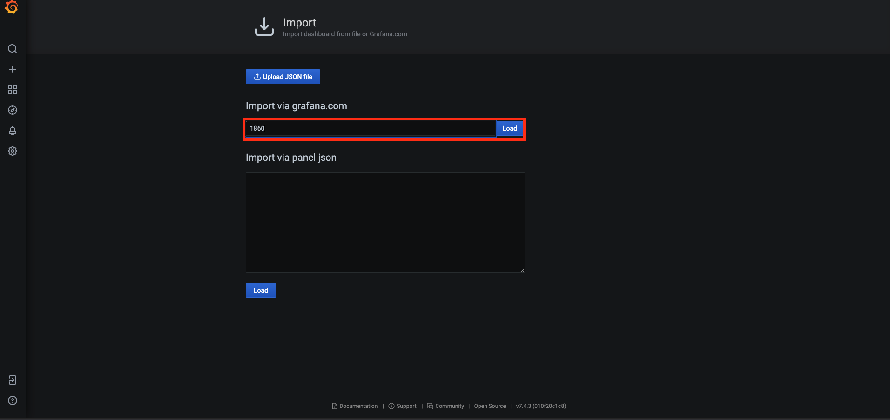
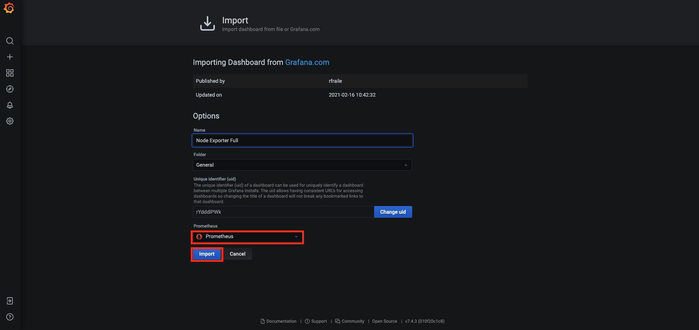

# 5장. 서버 리소스 모니터링하기 (1) node-exporter

## node-exporter란 무엇인가

`node-exporter`란 UNIX 계열 커널을 가진 하드웨어와 OS 관련 메트릭을 수집하는 익스포터이다. `Prometheus`가 공식적으로 지원하고 있으며 시스템에 아무 의존성이 없을 때 우선적으로 고려해 볼만한 익스포터이다.

> 참고! 익스포터란?
> 
> 익스포터란 특정 메트릭을 수집해서 엔드포인트에 노출시키는 소프트웨어 혹은 에이전트라고 보시면 됩니다. node-exporter가 UNIX 계열 서버의 cpu, memory 등의 메트릭을 수집할 수 있는 것처럼, DB, 하드웨어, 메세지 시스템, 저장소 등 여러 시스템에 대한 익스포터가 존재하며, CollectD 등 기존의 서버 모니터링에 사용되는 에이전트들과 통합할 수 있는 익스포터도 존재합니다.

## node-exporter 설치 및 연동

이제 서버 리소스를 모니터링하기 위해서 `node-exporter`를 설치할 것이다. 참고적으로 UNIX 계열 OS만 가능하기 때문에, Windows 운영 체제 실습자들은 VMware 등으로 Linux를 설치해서 실습하길 바란다. 물론 Windows OS 관련 익스포터도 존재하지만, 여기서는 다루지 않는다. 

### 로컬 환경에서 설치 및 연동

먼저 도커 기반으로 `mode-exporter`를 설치한다.

```bash
$ docker run -d \
  --net="host" \
  --pid="host" \
  -v "/:/host:ro,rslave" \
  quay.io/prometheus/node-exporter:latest \
  --path.rootfs=/host
```

끝이다. 추후, 모니터링 대시보드 구축을 위해 `Prometheus`랑 연동이 필요하다. 물론 `Docker`로 네트워크를 구성해서, 연동할 수 있긴 하지만 번거롭다. 따라서 이전 장과 마찬가지로 `docker-compose` 기반으로 컨테이너들을 구성한다. 이 절의 전체 코드는 다음에서 확인할 수 있다.

* [https://github.com/gurumee92/gurumee-prometheus-code/tree/master/part2/ch05](https://github.com/gurumee92/gurumee-prometheus-code/tree/master/part2/ch05)

구성된 `docker-compose.yml`을 확인해보자.

part2/ch05/docker-compose.yml
```yml
version: "3"

services:
  # prometheus
  prometheus:
    container_name: prometheus
    image: prom/prometheus:latest
    command:
      - '--config.file=/etc/prometheus/prometheus.yml'
      - '--storage.tsdb.path=/prometheus'
      - '--web.console.libraries=/usr/share/prometheus/console_libraries'
      - '--web.console.templates=/usr/share/prometheus/consoles'
    volumes:
      - ./config/prometheus.yml:/etc/prometheus/prometheus.yml
    ports:
      - 9090:9090

  # node-exporter server metric collect
  node-exporter:
    container_name: node-exporter
    image: prom/node-exporter
    volumes:
      - /proc:/host/proc:ro
      - /sys:/host/sys:ro
      - /:/rootfs:ro

  # dashboard & alert
  grafana:
    container_name: grafana
    image: grafana/grafana:latest
    ports:
      - "3000:3000"
    volumes:
      - ./config/datasource.yml:/etc/grafana/provisioning/datasources/datasource.yml
      - ./config/dashboard.yml:/etc/grafana/provisioning/dashboards/dashboard.yml
    environment:
      - GF_AUTH_ANONYMOUS_ENABLED=true
      - GF_AUTH_ANONYMOUS_ORG_ROLE=Admin
```

이전 장과 몇 가지 다른 점이 보인다. 바뀐 설정을 간략히 말해보자면 먼저 `Prometheus`는 `config/prometheus.yml` 설정 파일 기반으로 실행을 시킨다. 이 때, 이 설정 파일의 본문은 다음과 같다.

part2/ch05/config/prometheus.yml
```yml
# my global config
global:
  scrape_interval:     15s # By default, scrape targets every 15 seconds.
  evaluation_interval: 15s # By default, scrape targets every 15 seconds.
  
  external_labels:
    monitor: 'my-project'

rule_files:
  # - 'alert.rules'
  # - "first.rules"
  # - "second.rules"

# alert
# alerting:
#   alertmanagers:
#   - scheme: http
#     static_configs:
#     - targets:
#       - "alertmanager:9093"

# A scrape configuration containing exactly one endpoint to scrape:
# Here it's Prometheus itself.
scrape_configs:
  - job_name: 'prometheus'
    scrape_interval: 5s

    static_configs:
      - targets: ['localhost:9090']

  - job_name: 'node-exporter'
    scrape_interval: 5s

    static_configs:
      - targets: ['node-exporter:9100']
```

여기서 중요한 설정은 `scrape_configs`이다. 아래 보면 `job_name`이 있는데, 이것은 `Prometheus`가 메트릭을 pull하는 잡들을 말한다. 'prometheus' 잡은 자신 본인의 메트릭을 가져오는 것이고 `node-exporter` 잡은, 같은 네트워크 안에 있는 `node-exporter` 컨테이너가 수집하는 메트릭을 가져온다.

`Grafana` 설정은 이전 장에서 했던 로그인 기능과, 프로메테우스 연동 부분을 생략할 수 있게 해준다. `node-exporter`는 실제 로컬 머신의 메트릭을 수집하게 설정해 두었다. 따라서 `docker-compose`로 컨테이들을 모두 띄우면, `node-exporter`는 로컬 머신의 메트릭을 수집하고 `Prometheus`는 `node-exporter`가 수집하는 메트릭들을 가져와서 저장한다. `Grafana`는 데이터 소스로 연동된 `Prometheus`의 데이터를 쿼리할 수 가 있다. 자 이제 컨테이너를 띄어보자.

```bash
$ sudo docker-compose up -d
```

> 참고! 왜 sudo 명령어를 사용하나요?
> 
> node-exporter 컨테이너 볼륨 설정을 보면 로컬 머신의 root 경로의 파일들과 매핑이 되어 있습니다. 따라서, 이 컨테이너들의 실행은 sudo 권한이 있어야만 가능합니다.

이제 `Prometheus UI`에 접속해보자. 아래 화면에서 "up"이란 명령어를 입력해보자.


그럼 다음과 같이 `node-exporter` 인스턴스가 활성화된 것을 확인할 수 있다.


> 참고! 1은 무엇인가요?
> 
> 위 화면에서 "up" 쿼리 시 인스턴스 옆에 1은 활성화 되었음을 나타냅니다. 0은 비활성화입니다. 확인해보고 싶다면, "docker-compose stop node-exporter" 명령어를 입력해보세요. 그 후 다시 "up" 쿼리를 실행해보면, node-exporter 인스턴스가 0이 됨을 확인할 수 있습니다.

추후 이어지는 절은 서버 환경에서, `node-exporter` 설치 및 연동 작업을 설명한다. 만약 대시보드를 빠르게 구성하고 싶다면, 다음 절은 넘어가도 좋다.

### 서버 환경에서 설치 및 연동

이번에 서버 환경에서 `node-exporter` 설치 및 연동을 해보자. 역시 `Prometheus`를 설치한 서버에 설치를 진행한다. 터미널에 다음을 입력한다.

```bash
# app 경로로 이동
$ cd apps

# node-exporter 압축 파일 다운로드
$ wget https://github.com/prometheus/node_exporter/releases/download/v1.1.1/node_exporter-1.1.1.linux-amd64.tar.gz

# node-exporter 압축 파일 압축 해제
$ tar xvfz node_exporter-*.*-amd64.tar.gz

# node-exporter 루트 디렉토리 이름 변경
$ mv node_exporter-*.*-amd64 node_exporter

# 루트 디렉토리 이동
$ cd node_exporter

# 실행
$ ./node_exporter
level=info ts=2021-02-25T05:41:51.028Z caller=node_exporter.go:178 msg="Starting node_exporter" version="(version=1.1.1, branch=HEAD, revision=4e837d4da79cc59ee3ed1471ba9a0d9547e95540)"
...
level=info ts=2021-02-25T05:41:51.032Z caller=node_exporter.go:195 msg="Listening on" address=:9100
level=info ts=2021-02-25T05:41:51.032Z caller=tls_config.go:191 msg="TLS is disabled." http2=false
```

역시 터미널이 종료되면 `node-exporter`가 꺼지기 때문에, 서비스로 등록한다. 터미널에 다음을 입력하여 vim 을 연다.

```bash
$ sudo vim /etc/systemd/system/node-exporter.service
```

이후 `/etc/systemd/system/node-exporter.service`에 다음을 입력하고 저장한다.

/etc/systemd/system/node-exporter.service
```
[Unit]
Description=Node Exporter

[Service]
Restart=on-failure

#Change this line if you download the
#Prometheus on different path user
ExecStart=/home/ec2-user/apps/node_exporter/node_exporter

[Install]
WantedBy=multi-user.target
```

그 후 터미널에 다음을 입력한다.

```bash
# systemctl 데몬 리로드
$ sudo systemctl daemon-reload

# node-exporter 서비스 시작
$ sudo systemctl start node-exporter

# node-exporter 서비스 상태 확인
$ sudo systemctl status node-exporter
● node-exporter.service - Node Exporter
   Loaded: loaded (/etc/systemd/system/node-exporter.service; disabled; vendor preset: disabled)
   Active: active (running) since 목 2021-02-25 05:46:47 UTC; 2min 20s ago
 Main PID: 5274 (node_exporter)
   CGroup: /system.slice/node-exporter.service
           └─5274 /home/ec2-user/apps/node_exporter/node_exporter
...
```

이제 `curl` 명령어로, 다음을 확인해보자.

```bash
$ curl http://localhost:9100/metrics
# HELP go_gc_duration_seconds A summary of the pause duration of garbage collection cycles.
# TYPE go_gc_duration_seconds summary
go_gc_duration_seconds{quantile="0"} 0
go_gc_duration_seconds{quantile="0.25"} 0
go_gc_duration_seconds{quantile="0.5"} 0
go_gc_duration_seconds{quantile="0.75"} 0
....
```

이제 `Prometheus` 서버 설정을 바꿔보자. 터미널에 다음을 입력하여 `/apps/prometheus/prometheus.yml`을 다음과 같이 수정한다.

/home/ec2-user/apps/prometheus/prometheus.yml
```yml
# ...

scrape_configs:
  # The job name is added as a label `job=<job_name>` to any timeseries scraped from this config.
  - job_name: 'prometheus'

    # metrics_path defaults to '/metrics'
    # scheme defaults to 'http'.

    static_configs:
    - targets: ['localhost:9090']
  
  # 추가 부분
  - job_name: 'node-exporter'
    scrape_interval: 5s
    
    static_configs:
    - targets: ['localhost:9100']
```

그 후 `Prometheus`를 다시 재구동한다.

```bash
$ sudo systemctl restart prometheus
```

`Prometheus UI`에 접속했을 때 ("prometheus IP 주소:9090") "up" 쿼리 시, node-exporter 관련 정보가 뜬다면 성공이다.

## 모니터링 대시보드 구축

이제 `Grafana`에서 서버 리소스에 대한 모니터링 대시보드를 구축해보자. 이전에서 말했 듯이 `Grafana`는 공개된 템플릿을 통해서 간단하게 대시보드를 구축할 수가 있다. 다음 URL로 이동해보자.

* [node-exporter 그라파나 대시보드](https://grafana.com/grafana/dashboards/1860)

그러면 아래 화면이 보이는데 다음을 복사한다.


그 후 대시보드로 이동한 후, 왼쪽 탭의 두 번째 "+"의 "Import" 메뉴를 클릭한다.



그러면 다음 화면에서 아까 복사한 대시보드 ID를 입력하고 "Load" 버튼을 누른다.



그 후 "Datasource"에서 "Prometheus"를 선택한 뒤 "Import"를 누른다.



그럼 다음 화면이 보인다. 


기본 설정된 값으로는 잘 안보일 수 있으니 우측 상단 메뉴에서 "Last 5 Minutes"를 설정하고, 리프레시 간격을 5s로 바꾸는 것이 좋다. 실 서버에서는 서버 부하가 걸릴 수 있으니 15분에 10초가 적당하겠다.

이 대시보드에서 우리가 확인할 수 있는 지표들은 크게 다음과 같다.

* CPU
* Memory
* Disk
* Network
* File System
* System Daemon 
* Node Exporter 

이는 대시보드에서 확인할 수 있으니 한 번 확인해보라. 각 패널마다 `edit`을 누르면, `Grafana`에서 `Prometheus`를 어떻게 쿼리하는지 살펴볼 수 있다. 눈에 익도록 한 번씩 살펴두는 것이 좋다. 지금은 이해가 안가더라도 이 쿼리로 이런 지표를 땡겨온다 정도만 알고 있으면 된다.