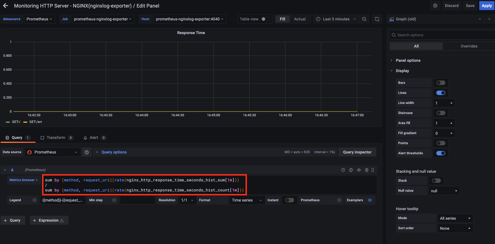

# Recording Rule


## 개요

이번 장에서는 `PromQL`의 쿼리 성능을 보다 높여줄 수 있는 `Recording Rule`에 대해 알아볼 것이다. 이 문서에서는 편의성을 위해서 `Docker` 환경에서 진행할 것이나, 실제 서버 환경에서 어떻게 작업해야 하는지까지 최대한 다루도록 하겠다. 관련 코드는 다음 링크를 참고하길 바란다.

* 이번 장 코드 : [https://github.com/gurumee92/gurumee-prometheus-code/tree/master/part4/ch02](https://github.com/gurumee92/gurumee-prometheus-code/tree/master/part4/ch02)

## Recording Rule은 무엇인가?

`Prometheus` 공식 문서에 따르면, `Recording Rule`의 정의는 다음과 같다.

> 기록 규칙은 일관된 이름 체계를 사용함으로써, 한 눈에 규칙을 쉽게 파악할 수 있다. 이것은 또한 부정확하거나 무의미한 계산을 두드러지게 함으로써 실수를 피한다.

개인적으로는 다소 뜬금 없는 표현이라고 생각되는데 쉽게 생각해서, `PromQL`을 통해서 집계한 시계열 데이터의 이름을 붙인다고 생각하면 된다. 예를 들면 지난 장 "[서비스 메트릭 모니터링하기 (1) prometheus-nginxlog-exporter]()"에서 `Nginx`의 1분간 평균 응답 시간에 대한 패널을 어떻게 구축했는가?



해당 패널은 다음 쿼리로 구성된다.

```
sum by (method, request_uri)(rate(nginx_http_response_time_seconds_hist_sum[1m])) 
/ 
sum by (method, request_uri)(rate(nginx_http_response_time_seconds_hist_count[1m]))
```

위의 쿼리는 단순한 수준에 속하지만 `PromQL`을 잘 모르는 경우에는 무슨 쿼리인지 도통 알아보기가 힘들다. 쿼리가 복잡해지면 복잡해질수록, 해석하기가 점점 히들어질 것이다. 이를 위해서 `Recording Rule`을 사용하면, 다음과 같이 단순하게 표현 가능하다.

```
job:nginx_http_response_time_seconds:avg_1m
```

다음과 같이 쿼리하게 되면 적어도, 패널이 쿼리하는 데이터가 1분간 집계된 평균 응답 시간이라는 것을 쉽게 알 수 있다. 사실은 이런 효과보다도, `InfluxDB`의 `Continuous Query` 같이, 복잡한 집계 쿼리를 배치를 돌듯 쿼리 결과를 하나의 시계열 데이터로 저장하여 쿼리 성능을 높이는 데 더 큰 의미가 있다고 생각한다.

## Recording Rule 사용법 (1) 작성 방법과 관례

`Recording Rule`을 만들기 위해서는 다음과 같은 절차가 필요하다.

1. Recording Rule 작성 (보통 <job_name>_rules.yml 파일에 작성한다.)
2. prometheus.yml에서 `rule_files` 설정 (<job_name>_rules.yml 상대 경로를 지정)

먼저 `Recording Rule`을 만들어보자. `prometheus.yml`이 저장된 디렉토리 경로에서 `rules`라는 디렉토리를 만들고 `prometheus_nginxlog_exporter_rules.yml`을 다음과 같이 작성한다.

[part4/ch02/prometheus/rules/prometheus_nginxlog_exporter_rules.yml]()
```yml
groups:
- name: prometheus_nginxlog_exporter
  rules:
  - record: job:nginx_http_response_time_seconds:avg_1m
    expr: |
      sum by (method, request_uri)(rate(nginx_http_response_time_seconds_hist_sum[1m])) 
      / 
      sum by (method, request_uri)(rate(nginx_http_response_time_seconds_hist_count[1m]))

  # ...
```

공식 문서에 따르면 다음의 네이밍 규칙을 권장하고 있다.

```
<level>:<metric>:<operations>
```

개인적으로는 "level"이 제일 이해가 안갔었는데, 보통 집계 수준을 정의한다. 쉽게 설명하자면, 현재처럼 method, request_uri 별이 아닌 method 별 응답 시간이었다면 `Recording Rule`은 다음과 같이 작성할 수 있다.

```yml
# ...
  rules:
  - record: method:nginx_http_response_time_seconds:avg_1m
    expr: |
      sum by (method)(rate(nginx_http_response_time_seconds_hist_sum[1m])) 
      / 
      sum by (method)(rate(nginx_http_response_time_seconds_hist_count[1m]))
```

어떤 기준으로 집계하는지에 따라, level을 달리 작성할 수 있을 것이다. 집계 수준이 2개 이상인 경우는 "job"으로 표현한다. "metric"은 실제 메트릭의 이름을 지정하면 된다. `Histogram`, `Summary` 메트릭 타입은 `nginx_http_response_time_seconds_hist_sum`처럼 메트릭 이름 이후에 `postfix`가 붙는다. 이때는 `postfix`를 제거한다. 그래서 `nginx_http_response_time_seconds`으로 지정한 것이다. "operations"는 집계 연산을 나타내면 된다. 위 `Recording Rule`은 1분간 평균이니까 `avg_1m`으로 지정했다.

`<job_name>_rules.yml`을 작성했으면, `prometheus.yml`에서 다음과 같이 설정하면 된다.

[part4/ch02/prometheus/prometheus.yml]()
```yml
# my global config
global:
  scrape_interval:     15s # By default, scrape targets every 15 seconds.
  evaluation_interval: 15s # By default, scrape targets every 15 seconds.

rule_files:
  - 'rules/prometheus_nginx_log_exporter_rules.yml' # prometheus.yml 상대 경로를 지정한다.

# ...
```

여기서 중요한 점은 `rule_files`에서 `<job_name>_rules.yml`의 경로를 지정해야 하는데, 이는 `prometheus.yml`에서 상대 경로로 지정된다. 보통 다음과 같은 위치를 가진다.

```
|- /home/ec2-user/apps/prometheus (prometheus 디렉토리)
    |- prometheus.yml
    |- rules
        |- prometheus_nginxlog_exporter_rules.yml
        |- ...
```

`prometheus.yml`을 수정한 후 `Prometheus`를 재시작 혹은 설정 리로드를 해주면 된다. 재시작은 다음 명령어로 실행할 수 있다.

```bash
$ sudo systemctl restart prometheus
```

설정 리로드는 "HUP" 시그널을 통해서 할 수 있다. 먼저 `Prometheus`의 "process id"를 알아낸 후 "kill -HUP" 명령어를 주면 된다.

```bash
# prometheus PID 알기
$ ps -ef | grep prometheus
# ...
root 17625 1 2 6월03 ? 09:53:10 /home/ec2-user/apps/prometheus/prometheus --config.file=/home/ec2-user/apps /prometheus/prometheus.yml --storage.tsdb.path=/home/ec2-user/apps/prometheus/data

# 설정 리로드
# sudo kill -HUP <pid> 
$ sudo kill -HUP 17625
```

## Recording Rule 사용법 (2) 권장되는 상황

`Recording Rule`이 권장되는 상황은 크게 다음과 같다.

1. PromQL 연산이 복잡한 경우 (이전 절 "Recording Rule 사용법 (1) 작성 방법과 관례"에서 다루었다.)
2. PromQL 집계 결과의 성능을 올리고 싶을 때 (=카디널리티를 줄이고 싶을 때)
3. 함수 입력으로 Range Vector를 넣고 싶을 때 (거의 사용되진 않음.)

`Recording Rule`의 주된 사용처는 2번이다. `PromQL`을 통해서 집계된 여러 시계열의 개수를 줄여, 쿼리 성능을 높이고 싶을 때 이것을 사용하면 매우 좋다.
 
## Recording Rule 사용법 (3) 권장되지 않는 상황