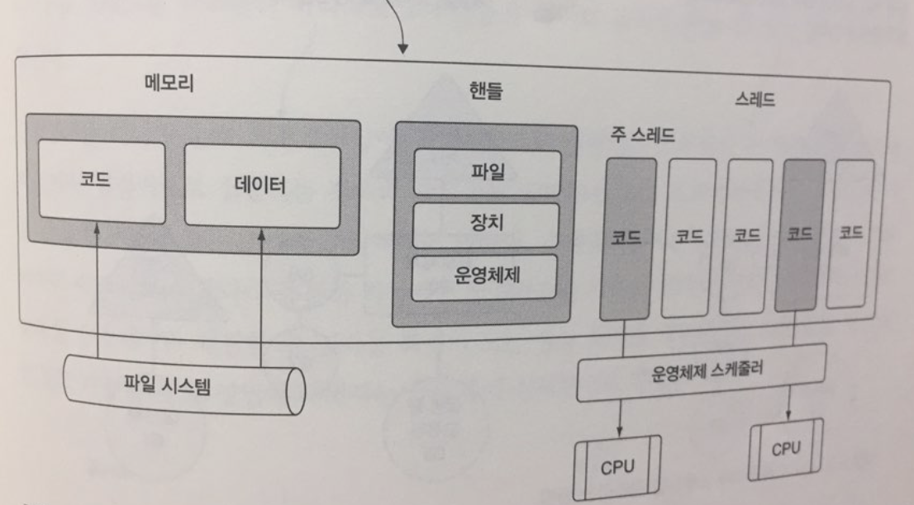

# 동시성

> 책 "Go In Action"을 공부하면서 정리한 문서입니다.

## 프로세스와 스레드, 동시성과 병렬성

`Go`에서의 동시성 처리 동기화는 `CSP`라는 패러다임에서 비롯되었다. `CSP`는 간단하게 말해, 동시 접근에 대해 잠금으로 처리하는 것이 아닌, 메세지를 전달하는 방식이다. 이 메세지를 전달하는 통로가 바로 "채널"이다.

위의 그림은 **프로세스**의 모습이다. 메모리 주소 공간, 파일 및 장치, 스레드에 대한 핸들을 비롯해 다양한 것이 포함된다. **스레드는 코드로 작성한 함수를 실행하기 위해 운영체제가 예약해둔 실행 경로**이다. 프로세스는 최소 하나의 스레드를 지닌다. (스레드는 프로세스의 포함됨) 
 

위의 그림은, `Go 런타임 스케줄러`는 하나의 운영체제 스레드에 바인딩된 논리적 프로세서에서 고루틴이 실행될 수 있게 예약함을 보여준다. 보통 다음의 순서를 따른다.

1) 고루틴이 생성된다.
2) 고루틴이 실행할 준비가 되면 스케줄러의 `Global Run Queue`에 위치한다.
3) 논리 프로세서가 고루틴을 큐에서 빼와서 실행한다.

위의 그림은 파일을 여는 등의 자신의 실행을 중단해야 하는 시스템 콜을 수행하는 경우를 보여준다. 다음의 순서를 따른다.

1) 논리 프로세서와 고루틴이 분리된다.
2) 스레드는 시스템 콜이 리턴될 때까지 대기한다. 
3) 논리 프로세서는 할당된 스레드가 없기 때문에, 스케줄러에서 새로운 스레드를 생성한다.
4) 새로운 스레드를 논리 프로세스에 연결한 후 `Local Run Queue`에서 다른 고루틴을 선택하여 실행한다.
5) 시스템 콜이 리턴되면 실행 중인 고루틴은 다시 `Local Run Queue`로 이동한다.

5번이 실행될 때, 다시 사용될 것을 대비하여 고루틴이 실행 중이던 스레드도 함꼐 보관된다.

위의 그림은 동시성과 병렬성의 차이를 보여준다. 이 둘은 다른 개념이다. 병렬성은 여러 논리 프로세스서에서 동시에 실행된다. 동시성은 한 번에 여러 작업을 수행하는 것을 말한다. 

보통 운영체제와 하드웨어에 가해지는 부담이 적기 때문에 동시성 처리가 병렬성 처리보다 성능이 우수한 경우가 많다.

## 고루틴

## 경쟁 상태와 락 기법

## 채널

버퍼가 없는 채널

버퍼가 있는 채널