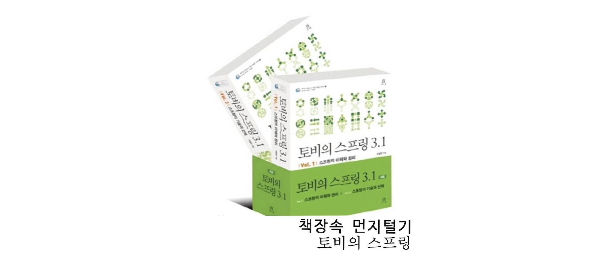

# 오브젝트와 의존관계 (2)



    책장속 먼지털기 스터디 2차
    스터디 날짜 : 2020.11.16 (불참)
    작성 날짜 : 2020.11.14 ~ 15
    페이지 : 102 ~ 143


## 싱글톤 레지스트르리? 

우리가 만든 `DaoFactory`를 직접 사용하는 것과, `@Configuration` 애노테이션으로 `ApplicationContext`에 등록해서 사용하는 것에는 어떤 차이가 있을까? 결론부터 말하면 차이는 스프링 빈이냐 아니냐의 차이다. 스프링 빈은 이전에 언급했 듯이, 스프링 IoC 컨테이너가 라이프 사이클을 관리하는 객체들이다. 스프링 빈은 특정 스코프를 가지는데 기본적으로 "싱글톤" 스코프를 가진다. 쉽게 말하면, 애플리케이션에서 딱 1개의 객체만 만들어진다.

이 후 챕터에서 다룰 것이지만 한 발 앞서서 JUnit5 라이브러리를 활용하여, 테스트 코드를 추가해보자. 


```java
// ..

class UserDaoTest {
    // ...

    @Test
    @DisplayName("동등성 테스트 - DaoFactory")
    public void test02() {
        DaoFactory factory = new DaoFactory();
        UserDao dao1 = factory.userDao();
        UserDao dao2 = factory.userDao();
        assertNotSame(dao1, dao2);
    }

    @Test
    @DisplayName("동등성 테스트 - ApplicationContext")
    public void test03() {
        ApplicationContext applicationContext = new AnnotationConfigApplicationContext(DaoFactory.class);
        UserDao dao1 = applicationContext.getBean(UserDao.class);
        UserDao dao2 = applicationContext.getBean(UserDao.class);
        assertSame(dao1, dao2);
    }
}
```

위의 2 테스트는 `DaoFactory`를 직접 사용하는 것과, 스프링 빈으로 등록시켜서 사용할 때의 차이를 극단적으로 보여준다. `assertNotSame`은 두 객체의 동일성이 틀린지에 대해 테스트한다.(dao1 != dao2) `assertSame`은 두 객체의 동일성이 같은지에 대해 테스트한다.(dao1 == dao2) 즉, 직접 `DaoFactory`를 만들어서 사용할 때, `userDao` 메소드를 호출할 때마다 새로운 객체를 반환한다. 반면에, 스프링 빈으로 등록했을 경우, `DaoFactory`, `UserDao` 모두 빈으로 등록되기 때문에 같은 객체를 반환하게 된다.

> 참고! 동일성과 동등성
> 
> "오브젝트가 동일하다", "오브젝트가 동등하다"라는 말은 얼핏 들으면 같은 말로 이해할 수 있습니다. 그러나 이들은 서로 다른 말입니다. 동일하다는 같은 객체인지를 판단합니다. 즉, 객체의 참조가 같은지를 따집니다. 자바에서는 "==" 연산자로 이를 확인할 수 있습니다. 반면에, 동등성은 객체에 들어있는 정보가 같은지를 판단합니다. 자바에서는 보통 "equals" 메소드를 호출하여 동등성을 판단하는 것이 관례입니다. 다만, 클래스에 동등성을 판단하는 equals 메소드가 적절하게 오버라이딩 되어 있지 않으면, 동등성이 꺠질 수 있다는 것을 알아두세요.


## DI

## Xml 기반 설정(vs 자바 코드 기반 설정)


## 스터디원들의 생각 공유

### 나의 질문과 답

1) 
2) 


### 스터디원들의 질문과 답

- 불참

### 면접 질문으로 생각해볼 것?

- 불참