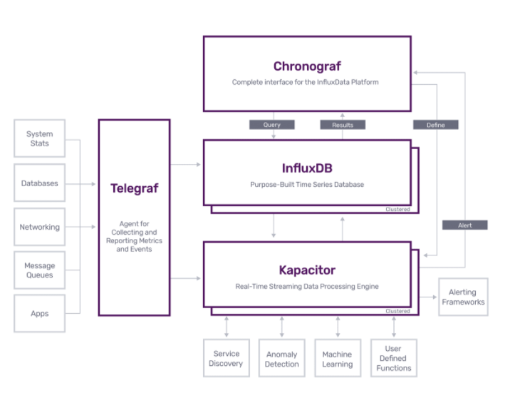
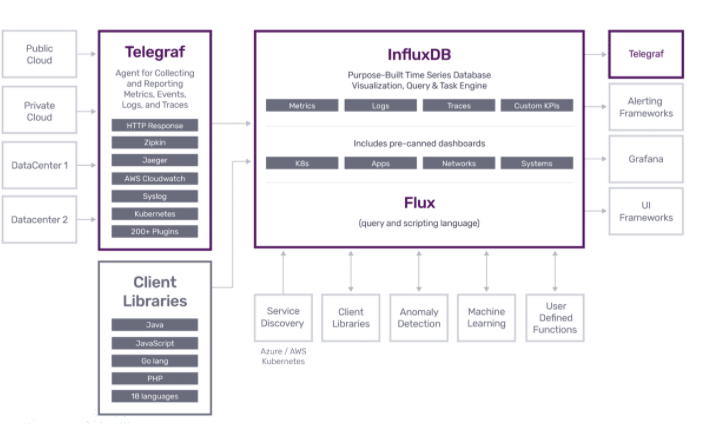

# InfluxDB 2.0이란 무엇인가?

> 이 문서는 간단하게 모니터링에 대한 개요와, InfluxDB 1.x 기반의 TICK 스택, 그리고 InfluxDB 2.0을 살펴봅니다.

## 모니터링에 대한 간단한 개요

컴퓨터 시스템 모니터링은 크게 4분류가 가능하다.

1. Alerting 시스템에 문제가 발생했을 때 책임 운영자에게 알린다.
2. Debugging 시스템에 문제가 발생했을 때 근본 원인을 규명한다.
3. Trending 시스템에 문제가 발생했을 때 자원들이 어떻게 사용되고 변화되는지 확인한다. `Capacitor Planning`에 영향을 미칠 수 있다.
4. Plumbing 모니터링 시스템을 용도에 맞게 적절하게 구성한다. (엄밀히 따지면 모니터링의 분류는 아니다.)

모니터링의 간단한 역사를 더 간단하게 요약했다.

* 초기 : 나기오스 + 그라파이트
* 2000년 대 : RRD -> 위스퍼, Collected, Statsd + 그라파나
* 현재 : 
    * 로그 분석 : Elastic 스택
    * 시스템 메트릭 : Prometheus
    * 시계열 데이터 : InfluxDB 2.0

모니터링은 기본적으로 **특정 이벤트**에 대한 것을 감시하는 것이다. 대표적인 예는 HTTP 요청과 응답, 디바이스 I/O, 커널 메모리, 사용자 로그인 등이 있다. 이러한 이벤트들을 모니터링을 위해서 처리 및 저장해야 하는데 그 양이 엄청나게 많아질 수 있다. 책에서는 그 양을 효과적으로 줄일 수 있는 방법은 다음과 같이 소개하고 있다.

* Profiling : 제한된 기간의 일부 컨텍스트를 자세히 기록.
    * Tcpdump : 네트워크 트래픽 프로파일링
    * Debug Builds  : 애플리케이션 프로파일링
    * 리눅스 커널 eBPF : 파일 시스템 ~ 네트워크 기호까지 커널 이벤트에 대해 프로파일링
* Tracing : 스택 트레이스에서 관심있는 부분의 함수들에 대한 정보를 기록, 
* Logging : 제한되 이벤트 집합을 살펴봄. 샘플링을 필요 없음.
    * 트랜잭션 로그 : 영원히 안전하게 저장해야 하는 비지니스 기록
    * 요청 로그 : HTTP, 데이터베이스 요청을 추적하는 로그
    * 애플리케이션 로그 : 애플리케이션에서 발생하는 이벤트를 기록. 분당 몇 개 정도가 적당
    * 디버그 로그 : 생성과 저장에 비용이 많이 듬. 디버깅 상황을 기록 
* Metric
    * 다양한 유형의 이벤트에 대해 시간에 따른 집계를 추적, 예를 들면, HTTP 요청 횟수, 응답 지연 시간 등이 있겠다.

정리하면, 메트릭으로 어떤 시스템이 문제를 일으키는지 살펴본 후, 로깅으로 그 시스템이 무슨 문제인지 정확하게 파악한다. 이 때 프로파일링, 트레이싱은 로깅을 분석하는데 도움을 줄 수 있다.

이러한 데이터는 모두 시간과 밀접한 관련이 있다. 이를 시계열 데이터, `Time Series Data`라고 하는데 `InfluxDB 2.0`은 모든 시계열 데이터를 모니터링한다.

## TICK 스택

먼저, `InfluxDB 2.0`의 전신인 `InfluxDB 1.x`와 그를 이루는 컴포넌트들에 간단히 살펴보고자 한다. 

위의 그림은 `Influx Data`에서 제공하고 있는 `InfluxDB 1.x`와 그를 이루는 컴포넌트들의 대략적인 관계를 나타내고 있다. 이들을 `TICK 스택`이라고 하는데 각각의 역할은 다음과 같다.

* Telegraf : 메트릭 등 시계열 데이터를 수집하는 에이전트
* InfluxDB : 시계열 데이터를 저장하는 저장소
* Chronograf : InfluxDB에 저장된 데이터를 시각화해서 볼 수 있는 UI
* Kapacitor : 데이터 프로세싱, 알림 기능을 제공하는 데이터 파이프라인 

사실 위 `TICK 스택`보단, `Telegraf + InfluxDB + Grafana(이하 TIG 스택)`를 이용해서 모니터링 시스템을 구축하는 곳이 더 많긴 하다. 

아무래도 `InfluxDB`를 쿼리하기 위해서는 `InfluxQL`을, `Kapacitor`를 이용하려면 `TICKscript`를 알아야 한다. 배우는데 비용이 많이 들기 때문에, `Grafana`에 알림 기능을 이용해서 `Kapacitor`를 제거한 느낌이다. 다만, `TIG 스택`을 사용하면, `Kapacitor`가 제공하는 메저먼트간 JOIN, UNION을 사용할 수 없게 된다.

> 참고!
> 
> 여러 지표를 조합하여, 알림을 만들 수 있을지라도, TICK을 이용했을 때보다, 성능이 떨어질 수 밖에 없습니다.

`TIG` 스택을 이용했을 때, 지표들을 조합해서 조금 더 복잡한 알림을 만들기 어렵기 때문에, 최근에는 메트릭 관련 모니터링에 대해서는 `Prometheus + Grafana` 조합을 선택하여, 모니터링 시스템을 구축하는 경우가 많다. 

## 완벽한 시계열 데이터 플랫폼 InfluxDB 2.0

이를 의식했는지 `Influx Data`도 `InfluxDB, Chronograf, Kapacitor`를 하나로 합쳐서 `InfluxDB 2.0`을 출시하였다.

기존 데이터 쿼리는 `InfluxQL`, 데이터 집계 및 처리는 `TICKscript`를 사용했던 것을 `Flux`라는 DSL 하나로 통일하였다. 조금더 프로그래밍 친화적으로 바뀌었다고 한다. (사실, 잘 모르겠지만 `Prometheus`의 `PromQL`보다는 쉬운 것 같다.)

> 참고!
> Flux는 InfluxDB 1.8에서도 사용이 가능합니다. 다만, 알림 및 태스크 기능은 사용할 수 없습니다.

아키텍처가 매우 `Prometheus`와 비슷해졌다. 단일 바이너리 파일로 이제 데이터 저장, UI, 알림 처리까지 모두 할 수 있게 되었다. 또한 기존 모니터링 시스템과의 마이그레이션 기능도 제공한다. `InfluxDB 1.x`, `Prometheus`라면 손쉽게 마이그레이션할 수 있다. 특히 `InfluxDB 1.x`를 쓰는 사람들에게는 불편했던 점들을 많이 해소시켜줄 것이다.

이제 `InfluxDB 2.0`을 본격적으로 공부해보자. 앞으로의 문서들은 `InfluxDB 2.0` 공식 문서와, 책 "프로메테우스 오픈소스 모니터링 시스템"을 참고하여 작성될 예정이다.

## 참고

- 책 "프로메테우스 오픈소스 모니터링 시스템"
- InfluxData 공식 문서