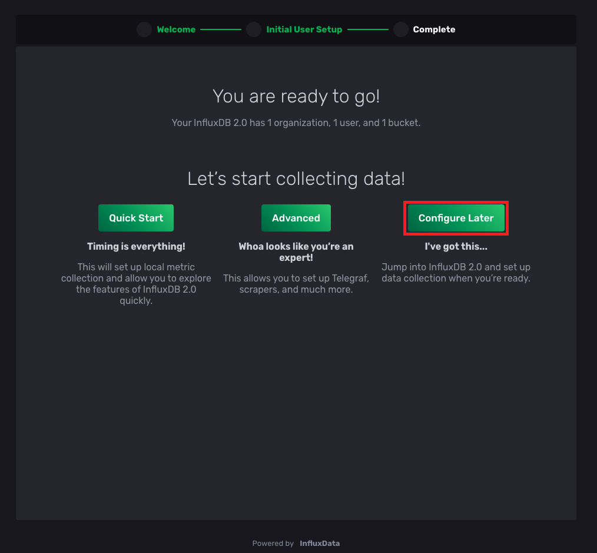

# InfluxDB 2.0 시작하기


> 이 문서는 InfluxDB 2.0를 이용하여, 모니터링 시스템을 구축하는 것에 대하여 다루고 있습니다.

## 요구 사항

이번 문서를 진행하기 위한 나의 환경은 다음과 같다.

- RedHat/CentOS 기반 운영체제
- 포트 8086에, http 접근 허용

레드햇 계열 리눅스와 `CentOS`는 이 문서가 `InfluxDB 2.0`를 포함한 모니터링 시스템을 구축하는데 도움이 될 것이다. (아마 다른 운영체제도 비슷할 것이다.) 자 시작해보자.


## InfluxDB 2.0 설치

현재 안타깝지만, `InfluxDB 2.0`을 한 번에 설치할 수 있는 패키지가 준비되어 있지 않다.(내가 아는 한...) 그래서 바이너리 파일을 직접 설치할 것이다. 먼저 서버 내에서 적당한 디렉토리로 이동한 후, 다음을 순서대로 입력한다. 

```bash
# 현재 위치
$ pwd
/home/ec2-user

# 나의 경우 "apps"이란 디렉토리에 설치 파일들을 모아둔다. 그래서 apps 디렉토리로 이동한다.
$ cd apps

# 공식 문서에서 제공되는 influxdb 2.0 바이너리 파일이 압축된 tar 파일 다운로드 경로이다.
$ wget https://dl.influxdata.com/influxdb/releases/influxdb-2.0.0-rc.3_linux_amd64.tar.gz
--2020-11-03 01:59:49--  https://dl.influxdata.com/influxdb/releases/influxdb-2.0.0-rc.3_linux_amd64.tar.gz
Resolving dl.influxdata.com (dl.influxdata.com)... 13.249.43.98, 13.249.43.124, 13.249.43.59, ...
Connecting to dl.influxdata.com (dl.influxdata.com)|13.249.43.98|:443... connected.
HTTP request sent, awaiting response... 200 OK
Length: 46135619 (44M) [application/x-gzip]
Saving to: ‘influxdb-2.0.0-rc.3_linux_amd64.tar.gz’

100%[===================================================================================================================>] 46,135,619  27.8MB/s   in 1.6s

2020-11-03 01:59:51 (27.8 MB/s) - ‘influxdb-2.0.0-rc.3_linux_amd64.tar.gz’ saved [46135619/46135619]

# 다운로드 확인
$ ll
합계 48660
-rw-rw-r-- 1 ec2-user ec2-user 49826885 10월 29 22:29 influxdb-2.0.0-rc.3_darwin_amd64.tar.gz

# 압축 파일 해제
$ tar zxvf influxdb-2.0.0-rc.3_linux_amd64.tar.gz
influxdb-2.0.0-rc.3_linux_amd64/LICENSE
influxdb-2.0.0-rc.3_linux_amd64/README.md
influxdb-2.0.0-rc.3_linux_amd64/influx
influxdb-2.0.0-rc.3_linux_amd64/influxd

# 실행 경로에 "influx", "influxd"를 옮긴다. 나의 실행 경로는 "/usr/local/bin"이다.
$ sudo cp influxdb-2.0.0-rc.3_linux_amd64/{influx,influxd} /usr/local/bin/

# influxdb 실행
$ influxd
2020-11-03T02:02:35.897826Z	info	Welcome to InfluxDB	{"log_id": "0QEyJTzG000", "version": "2.0.0-rc.3", "commit": "f46a3bd91e", "build_date": "2020-10-29T22:17:55Z"}
2020-11-03T02:02:35.902393Z	info	Resources opened	{"log_id": "0QEyJTzG000", "service": "bolt", "path": "/home/ec2-user/.influxdbv2/influxd.bolt"}
2020-11-03T02:02:35.903899Z	info	Migration "initial migration" started (up)	{"log_id": "0QEyJTzG000", "service": "migrations"}
2020-11-03T02:02:35.964158Z	info	Migration "initial migration" completed (up)	{"log_id": "0QEyJTzG000", "service": "migrations"}
...
```

그 후 브라우저에서, 현재 머신의 IP 주소 + 8086 포트에 접속하면, 다음 화면을 확인할 수 있다. 나의 경우 `AWS Linux AMI`을 이용하기 때문에, 해당 경로로 접속하면 다음 화면을 확인할 수 있다.


## InfluxDB 2.0 설정

바로 공식 문서대로 UI기반으로 `InfluxDB 2.0`을 세팅할 수 있다. 그 전에 조금 더 편하게 운영하기 위해서, 서비스 형태로 `InfluxDB 2.0`을 구동시켜보자. 먼저, 터미널에서 실행하고 있는 `influxd`를 종료한다.

리눅스의 경우, `systemctl`로 `.service`파일을 서비스로 시작/종료/상태 확인이 가능하다. `systemctl` 명령어는 `/lib/sytemd/system` 디렉토리 밑에 `.service` 파일들을 참조하기 때문에  `influxdb2.service` 파일을 "sudo" 권한으로 해당 디렉토리 경로에 생성한다. 

```bash
$ sudo vi /lib/systemd/system/influxdb2.service
```

그럼 vi 터미널이 열리는데, 다음을 입력한다.

```service
[[Unit]
Description=InfluxDB 2.0 service file.

[Service]
ExecStart=/usr/local/bin/influxd
Restart=on-failure
StartLimitBurst=2
StartLimitInterval=30

[Install]
WantedBy=multi-user.target
```

`:wq` 명령어를 눌러 저장하고 종료한다. 이제 터미널에 다음을 입력한다.

```bash
# 서비스 실행
$ sudo systemctl start influxdb2

# 서비스 상태 확인
$ sudo systemctl status influxdb2
● influxdb2.service - InfluxDB 2.0 service file.
   Loaded: loaded (/usr/lib/systemd/system/influxdb2.service; disabled; vendor preset: disabled)
   Active: active (running) since 화 2020-11-03 02:39:54 UTC; 10s ago
 Main PID: 15094 (influxd)
   CGroup: /system.slice/influxdb2.service
           └─15094 /usr/local/bin/influxd

...
```

역시 같은 경로로 접속하면 다음 화면을 확인할 수 있다.


이제 "Get Started"를 눌러서 세팅을 진행해보자.


그럼 위의 화면이 뜨는데, 입력 창에 값을 적적하게 넣어준 후 "Continue"를 눌러보자.



이제 "Continue Later"를 클릭한다.


그럼 다음 화면이 뜬다. 이렇게 해서 `InfluxDB 2.0` 설정이 끝났다. 
 
## Telegraf 설치

이제 머신에 `Telegraf`를 설치하여 시스템 메트릭을 수집하여 `InfluxDB 2.0`에 저장해 볼 것이다.

## InfluxDB 2.0 - Telegraf 연동
