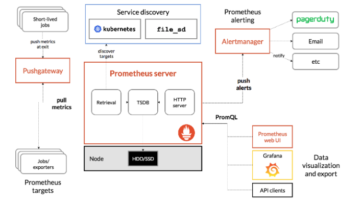

# 프로메테우스란 무엇인가

> 책 "프로메테우스 오픈소스 모니터링 시스템"을 읽고 정리한 문서입니다.

## 모니터링이란 무엇인가

컴퓨터 시스템 모니터링은 크게 4분류가 가능하다.

1. Alerting 시스템에 문제가 발생했을 때 책임 운영자에게 알린다.
2. Debugging 시스템에 문제가 발생했을 때 근본 원인을 규명한다.
3. Trending 시스템에 문제가 발생했을 때 자원들이 어떻게 사용되고 변화되는지 확인한다. `Capacitor Planning`에 영향을 미칠 수 있다.
4. Plumbing 모니터링 시스템을 용도에 맞게 적절하게 구성한다. (엄밀히 따지면 모니터링의 분류는 아니다.)

모니터링의 간단한 역사를 더 간단하게 요약했다.

* 초기 : 나기오스 + 그라파이트
* 2000년 대 : RRD -> 위스퍼, Collected, Statsd + 그라파나
* 현재 : 
    * 로그 분석 시스템 : Elastic 스택
    * 메트릭 모니터링 : Prometheus, TICK 스택(InfluxDB 2.0으로 변경 예정)

모니터링은 기본적으로 "특정 이벤트"에 대한 것을 감시하는 것이다. 대표적인 예는 HTTP 요청과 응답, 디바이스 I/O, 커널 메모리, 사용자 로그인 등이 있다. 이러한 이벤트들을 모니터링을 위해서 처리 및 저장해야 하는데 그 양이 엄청나게 많아질 수 있다. 책에서는 그 양을 효과적으로 줄일 수 있는 방법은 다음과 같이 소개하고 있다.

* Profiling : 제한된 기간의 일부 컨텍스트를 자세히 기록.
    * Tcpdump : 네트워크 트래픽 프로파일링
    * Debug Builds  : 애플리케이션 프로파일링
    * 리눅스 커널 eBPF : 파일 시스템 ~ 네트워크 기호까지 커널 이벤트에 대해 프로파일링
* Tracing : 스택 트레이스에서 관심있는 부분의 함수들에 대한 정보를 기록, 
* Logging : 제한되 이벤트 집합을 살펴봄. 샘플링을 필요 없음.
    * 트랜잭션 로그 : 영원히 안전하게 저장해야 하는 비지니스 기록
    * 요청 로그 : HTTP, 데이터베이스 요청을 추적하는 로그
    * 애플리케이션 로그 : 애플리케이션에서 발생하는 이벤트를 기록. 분당 몇 개 정도가 적당
    * 디버그 로그 : 생성과 저장에 비용이 많이 듬. 디버깅 상황을 기록 
* Metric
    * 다양한 유형의 이벤트에 대해 시간에 따른 집계를 추적, 예를 들면, HTTP 요청 횟수, 응답 지연 시간 등이 있겠다.

정리하면, 메트릭으로 어떤 시스템이 문제를 일으키는지 살펴본 후, 로깅으로 그 시스템이 무슨 문제인지 정확하게 파악한다. 이 때 프로파일링, 트레이싱은 로깅을 분석하는데 도움을 줄 수 있다. 참고적으로 프로메테우스는 "메트릭 모니터링"에 집중한다.

## 프로메테우스란 무엇인가

공식 문서에서는, 프로메테우스를 다음과 같이 소개하고 있다.

    Prometheus 는 원래 SoundCloud에 구축 된 오픈 소스 시스템 모니터링 및 알림 툴킷 입니다. 
    2012 년에 시작된 이래 많은 회사와 조직에서 Prometheus를 채택했으며이 프로젝트에는 매우 
    활발한 개발자 및 사용자 커뮤니티가 있습니다. 이제 독립형 오픈 소스 프로젝트이며 어떤 회사와도
    독립적으로 유지됩니다. 이를 강조하고 프로젝트의 거버넌스 구조를 명확히하기 위해 Prometheus는
    2016 년에 Kubernetes 에 이어 두 번째 호스팅 프로젝트로 Cloud Native Computing Foundation 
    에 합류했습니다

프로메테우스는 시계열 데이터베이스를 포함한, UI, 알림 등 여러 기능들을 제공하는 툴킷으로 "메트릭 기반" 모니터링 시스템이다. 구조가 간단하여 운영이 쉽고 무엇보다 최근 트렌드인 쿠버네티스 환경을 모니터링하는데, 가장 좋다고 평가받고 있다. 

## 프로메테우스 아키텍처

위 그림은 프로메테우스 공식 문서에서 제공하는, 전반적인 아키텍처를 잘 설명하고 있다. 구성 요소는 크게 다음과 같이 분류할 수 있다.

* 프로메테우스 서버
* 클라이언트 라이브러리
* 익스포터
* 푸쉬 게이트웨이
* 알림 매니저
* 대시보드

프로메테우스 서버는 아키텍처의 중심이다. 시계열 데이터를 저장한다. 알아둘 것은 최근 트렌드와 달리 프로메테우스는 클러스터링을 시도하지 않는다. 분산 처리는 데이터 신뢰성 확보가 어렵기 때문이다. 따라서, 단일 노드를 설치하는 것이 권장된다. 또한, "서비스 디스커버리"를 통해 데이터 수집 대상을 발견한다. 

클라이언트 라이브러리와 익스포터는 데이터를 수집한다. 클라이언트 라이브러리는 애플리케이션 코드에서 개발자가 지정한 서비스 메트릭을 수집할 수 있으며, 보통 "푸쉬 게이트웨이"에 이 데이터를 전송한다. 그러면 프로메테우스 서버가 이 수집된 메트릭을 풀링한다. 익스포터는 기본적으로 시스템 메트릭을 주로 수집한다. 또한 여러 서드 파트 익스포터가 있으며 예를 들어서 `Graphite`, `NGINX` 같은 서비스들이 수집하는 메트릭을 프로메테우스 서버가 풀링할 수 있게 도와준다.

알림 매니저는 알림을 만들고 관리할 수 있다. `Recording Rule`을 `PromQL` 표현식을 정기적으로 수행하여, 그 결과는 알림이 된다. 이 알림은 `Pagerduty`, `Slack`, 이메일 등으로 전송할 수 있다. 

대시보드는, 프로메테우스 내장 UI, `Grafana` 등을 사용할 수 있다. 이들은 `PromQL`을 사용하여, 저장된 데이터를 쿼리한다.

> 참고!
> 
> PromQL은 프로메테우스의 Domain Specific Language입니다. 쉽게 생각하면, RDB의 SQL 같은 존재입니다. 프로메테우스에서 데이터 쿼리는 물론, 태스크, 알림 등을 만들 때 사용합니다.

## 참고

- [프로메테우스 공식 문서](https://prometheus.io/docs/introduction/overview/)
- 책 "프로메테우스 오픈소스 모니터링 시스템"