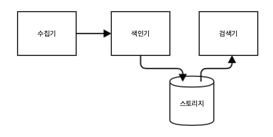

1장 검색 시스템 이해하기
=====================

> 책 "엘라스틱 서치 실무 가이드" 정리한 문서입니다. 책은 저자들의 소중한 자산이기 때문에 책에 나와 있는 모든 내용을 기술하지 않고 최대한 압축해서 정리할 예정입니다. 이 책을 정리하는 이유는 "11번가 하계 인턴" 동안 수행해야 하는 개인 과제 "통합 검색 서비스"를 만들기 위해서 연구 목적입니다. 

Contents
-----------

1. 검색 시스템의 이해
2. 검색 시스템과 엘라스틱서치
3. 실습 환경 구축

검색 시스템의 이해
-----------

### 검색 엔진? 검색 시스템? 검색 서비스?


* 검색 엔진 : 광활한 웹에서 정보를 수집해 검색 결과를 제공하는 프로그램입니다.
* 검색 시스템 : 대용량 데이터를 기반으로 신뢰성 있는 검색 결과를 제공하기 위해 "검색 엔진" 기반으로 구성된 시스템을 뜻합니다.
* 검색 서비스 : 검색 시스템을 활용하여 검색 결과를 제공하는 서비스를 뜻합니다.

### 검색 시스템 구성 요소



* 수집기 : 웹사이트, 블로그, 카페 등 웹에서 필요한 모든 정보를 수집하는 프로그램을 말합니다. 흔히 크롤러, 스파이더라고도 합니다.
* 스토리지 : 데이터 저장소를 뜻합니다. 검색 엔진은 색인한 데이터를 이 곳에 보관합니다.
* 색인기 : 수집된 데이터를 검색 가능한 구조로 가공하고 저장하는 역할을 합니다. 보통 다양한 형태소 분석기와 조합해서 사용됩니다.
* 검색기 : 사용자 질의를 입력 받아 색인기에서 저장한 역색인 구조에서 일치하는 문서를 찾아 결과를 반환합니다.

### RDBMS vs ElasticSearch

사실 기존, RDBMS 자체로도 어느 정도 검색 서비스를 만들 수 있습니다. 한 번 기존 RDBMS와 엘라스틱 서치의 구성 단위를 비교해보도록 하겠습니다.

| ES | RDBMS | Description |
| :--: | :--: | :--: |
| Index | Database | 시스템에서 가장 큰 단위 |
| Shard | Partition | Index의 데이터를 저장하여 Indexing된 Document가 실제로 저장되는 곳 |
| Type | Table | 일종의 데이터 구조 |
| Document | Row | 데이터의 한 행 |
| Field | Column | 데이터의 한 행의 열 1개 |
| Mapping | Schema | 필드의 구조와 제약조건에 대한 명시 |
| Query DSL | SQL | 질의 언어 |

데이터 CRUD 방식도 비교해보도록 하겠습니다. ES 는 http 기반 REST API 를 제공합니다. 반면, RDBMS 는 데이터베이스 시스템에서 쿼리를 날려야 하지요.

| CRUD | ES | RDBMS |
| :--: | :--: | :--: |
| 데이터 조회 | GET | SELECT |
| 데이터 생성 | POST | INSERT |
| 데이터 수정 | PUT | UPDATE |
| 데이터 삭제 | DELETE | DELETE |
| 인덱스 정보 확인 | HEAD | - |

> Q. RDBMS도 LIKE 문을 통해 저장된 데이터에서 검색 결과를 추출할 수 있다. 근대 왜 검색 엔진이 나왔을까요?

> A. 그 이유는 일반적인 RDBMS는 전문 검색(Full Text Search) 기능이 지원되지 않기 때문입니다. 동의어, 유의어 처리를 할 수 없기 때문이지요. 이러한 문제 때문에 검색 엔진은 탄생하게 되었습니다. 현재 대부분의 검색 엔진은 형태소 분석기를 포함하고 있기 때문에 RDBMS보다 더 고급진 검색 기능을 지원한답니다.

검색 시스템과 엘라스틱서치
-----------

보통 대량의 데이터를 빠르게 검색하기 위해서 요즘에는 `RDBMS`가 아닌 `NoSQL`을 많이 쓴다. 엘라스틱서치는 `NoSQL`의 일종으로 분산처리를 통해 실시간에 준하는 빠른 검색이 가능합니다. 한 마디로, 엘라스틱서치의 용도는 **대용량 분산 스토리지와 전문 검색이 가능한 검색엔진**이라고 보면 됩니다. 책에서 말하는 엘라스틱의 장단점은 다음과 같습니다.

**장점**

* 오픈소스 검색엔진
* 전문 검색
* 통계 분석
* 스키마리스 - 비정형 데이터를 수집, 통계 분석이 가능합니다.
* RESTful API
* Multi-Tenancy - 상이한 서비스일지라도 필드만 같으면, 여러 개의 인덱스를 한 번에 조회할 수 있습니다.
* 역색인 구조.
* 확장성과 가용성

**단점**

* 정확히 실시간 X - NRT(Near Reartime) 시스템, 즉 실 시간에 준하는 쿼리 능력을 보여줍니다. 큰 단점은 아닙니다.
* 트랜잭션 롤백 제공 X 
* 데이터 업데이트 제공 X - 기존 문서를 싹 삭제하고 다시 데이터를 넣는 방식입니다.

실습 환경 구축
-----------

저의 실습 환경은 맥 기준입니다. 일단 `Homebrew`가 설치되어 있다고 가정합니다. `Homebrew` 설치 및 자세한 정보는 다음을 참고하세요.

[Homebrew 공식 홈페이지](https://brew.sh/index_ko)

### Java 설치

```bash
$ brew tap AdoptOpenJDK/openjdk
$ brew install adoptopenjdk-openjdk8
```

엘라스틱 스택은 사실 맥의 경우 `Homebrew`로 설치가 가능합니다만, 책을 따라 6.4.3 버전을 설치하도록 하겠습니다.

### Elasticsearch 설치

[Elasticsearch 6.4.3 Download](https://www.elastic.co/kr/downloads/past-releases/elasticsearch-6-4-3)

위의 경로를 이동하여 각자 운영체제에 맞는 sha 를 다운받으면 됩니다. mac OS 기준, tar 파일이 설치되는데 다음 명령어들을 차례대로 입력해 보세요.

```bash
# cd Downloads
$ ~/Downloads

# tar file
$ tar -xvzf elasticsearch-6.4.3.tar

# cd elasticsearch-6.4.3
$ cd elasticsearch-6.4.3

# run elasticsearch
$ ./bin/elasticsearch
```

그러면 다음 문구가 끝에 뜰 것입니다.

```
[2019-07-09T15:50:06,080][INFO ][o.e.n.Node               ] [6yON4pY] started
[2019-07-09T15:50:06,092][WARN ][o.e.x.s.a.s.m.NativeRoleMappingStore] [6yON4pY] Failed to clear cache for realms [[]]
[2019-07-09T15:50:06,152][INFO ][o.e.g.GatewayService     ] [6yON4pY] recovered [0] indices into cluster_state
[2019-07-09T15:50:06,322][INFO ][o.e.c.m.MetaDataIndexTemplateService] [6yON4pY] adding template [.watch-history-9] for index patterns [.watcher-history-9*]
[2019-07-09T15:50:06,348][INFO ][o.e.c.m.MetaDataIndexTemplateService] [6yON4pY] adding template [.watches] for index patterns [.watches*]
[2019-07-09T15:50:06,375][INFO ][o.e.c.m.MetaDataIndexTemplateService] [6yON4pY] adding template [.triggered_watches] for index patterns [.triggered_watches*]
[2019-07-09T15:50:06,412][INFO ][o.e.c.m.MetaDataIndexTemplateService] [6yON4pY] adding template [.monitoring-logstash] for index patterns [.monitoring-logstash-6-*]
[2019-07-09T15:50:06,454][INFO ][o.e.c.m.MetaDataIndexTemplateService] [6yON4pY] adding template [.monitoring-es] for index patterns [.monitoring-es-6-*]
[2019-07-09T15:50:06,484][INFO ][o.e.c.m.MetaDataIndexTemplateService] [6yON4pY] adding template [.monitoring-beats] for index patterns [.monitoring-beats-6-*]
[2019-07-09T15:50:06,513][INFO ][o.e.c.m.MetaDataIndexTemplateService] [6yON4pY] adding template [.monitoring-alerts] for index patterns [.monitoring-alerts-6]
[2019-07-09T15:50:06,541][INFO ][o.e.c.m.MetaDataIndexTemplateService] [6yON4pY] adding template [.monitoring-kibana] for index patterns [.monitoring-kibana-6-*]
[2019-07-09T15:50:06,649][INFO ][o.e.l.LicenseService     ] [6yON4pY] license [8ac62b6d-99e6-44e2-aa3b-c674a85af2fc] mode [basic] - valid
```

이제 `http://loaclhost:9200`으로 접속해보세요. 결과가 다음의 JSON 형식으로 뜬다면 정상적으로 설치된 것입니다.

```json
{
  "name" : "6yON4pY",
  "cluster_name" : "elasticsearch",
  "cluster_uuid" : "GeJQ62jwS8SoEyZx1zwejA",
  "version" : {
    "number" : "6.4.3",
    "build_flavor" : "default",
    "build_type" : "tar",
    "build_hash" : "fe40335",
    "build_date" : "2018-10-30T23:17:19.084789Z",
    "build_snapshot" : false,
    "lucene_version" : "7.4.0",
    "minimum_wire_compatibility_version" : "5.6.0",
    "minimum_index_compatibility_version" : "5.0.0"
  },
  "tagline" : "You Know, for Search"
}
```

책에서는 원활한 실습을 위해 플러그인 및 스냅숏을 제공합니다. 여기서는 기술하지 않습니다. 이제 `config/elasticsearch.yml` 을 다음과 같이 수정합시다.

elasticsearch-6.4.3/config/elasticsearch.yml
```yml
cluster.name: javacafe-cluster
node.name: javacafe-node1
network.host: 0.0.0.0
http.port: 9200
transport.tcp.port: 9300
node.master: true
node.data: true
```

위는 `Elasticsearch`에서 제공하는 설정 프로퍼티들을 이용하여 설치한 엘라스틱서치를 설정한 것입니다. 자 이제 설정 프로퍼티들에 대해서 알아보겠습니다.

* cluster.name - 엘라스틱서치는 클러스터로 여러 노드를 하나로 묶을 수 있는데, 이 때 지정하는 클러스터 명입니다.
* node.name - 엘라스틱서치 노드명을 설정합니다. 노드명을 지정하지 않으면 엘라스틱서치가 임의의 이름을 설정합니다.
* path.data - 엘라스틱서치의 인덱스 경로를 지정합니다. 설정하지 않으면 디폴트로 엘라스틱서치 하위 폴더 data에 인덱스를 설정합니다.
* path.logs - 엘라스틱서치의 노드와 클러스터에서 생성되는 로그를 저장할 경로를 지정합니다. 기본 경로는 "/path/to/log" 입니다.
* path.repo - 앨라스틱서치 인덱스를 백업하기 위한 스냅샷의 경로를 설정합니다. 
* network.host - 엘라스틱서치의 접근 가능한 IP를 지정합니다.
* http.port - 엘라스틱서치 http port를 설정합니다. 기본은 9200입니다.
* transport.tcp.port - 엘라스틱서치 tcp port를 설정합니다. 기본은 9300입니다.
* discovery.zen.ping.unicast.hosts - 노드가 여러 개인 경우 유니캐스트로 활성화된 다른 서버를 찾습니다. 클러스터로 묶인 노드의 IP를 지정하면 됩니다.
* discovery.zen.minimum_nodes - 마스터 노드의 선출 기준이 되는 노드의 수를 지정합니다.
* node.master - 마스터 노드 동작 여부를 지정합니다.
* node.data - 데이터 노드 동작 여부를 지정합니다.

### Kibana 설치

키바나는 엘라스틱에서 제공하는 데이터 시각화 프로그램입니다. 시각화 기능 뿐 아니라 엘라스틱 서치에서 색인된 데이터 검색, 문서 추가, 삭제 등의 기능을 보다 손쉽게 구현할 수 있습니다. 또한 엘라스틱 스택의 다른 컴포넌트들의 모니터링도 가능합니다.(아마..?) 역시 버전은 6.4.3 을 설치합니다.

[Kibana 6.4.3 Download](https://www.elastic.co/kr/downloads/past-releases/kibana-6-4-3)

같은 방식으로 설치하면 됩니다.

```bash
# cd Downloads
$ ~/Downloads

# tar file
$ tar -xvzf kibana-6.4.3.tar


# cd elasticsearch-6.4.3
$ cd kibana-6.4.3
```

먼저 키바나를 키기 전에 엘라스틱 서치와 연동을 먼저 해야 합니다. `config/kibana.yml`을 다음과 같이 수정하세요.

kibana-6.4.3/config/kibana.yml
```yml
elasticsearch.url: "http://localhost:9200"
```

그 후 다음 명령어를 입력해서 키바나를 실행시키면 됩니다.

```bash
# run kibana
$ ./bin/kibana
```

그 후 `http://localhost:5601`에 접속하시면 키바나 기본 페이지가 뜬다면, 성공입니다. 요즘은 도커로도 설치를 많이 하는 것 같습니다. 저의 맥북 기준 1시간 정도 다운로드 소요 시간이 걸렸는데 도커로 설치하시면 길어봐야 10분이면 설치가 가능합니다. 이 방법은 따로 기술하진 않습니다. 이상 1장 정리 마치겠습니다.