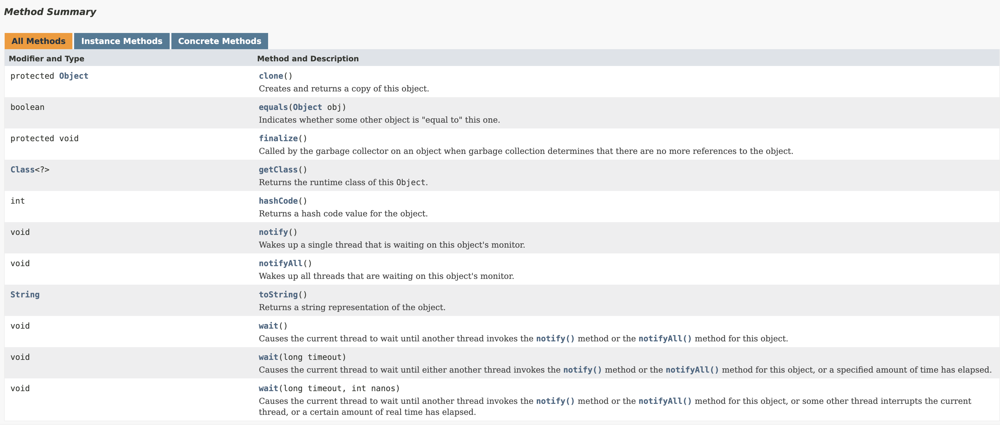

# 모든 객체의 공통 메소드

> 책 "이펙티브 자바 3판"을 공부하면서 정리한 문서입니다.

## 목차

- [모든 객체의 공통 메소드](#모든-객체의-공통-메소드)
  - [목차](#목차)
  - [equals는 일반 규약을 지켜 재정의하라](#equals는-일반-규약을-지켜-재정의하라)
  - [equals를 재정의하려거든 hashcode도 재정의하라](#equals를-재정의하려거든-hashcode도-재정의하라)
  - [toString은 항상 재정의하라](#tostring은-항상-재정의하라)
  - [clone 재정의는 주의해서 진행하라](#clone-재정의는-주의해서-진행하라)
  - [Comparable을 구현할지 고려하라](#comparable을-구현할지-고려하라)

이번 장에서는 Java의 클래스의 최상위 클래스 Object의 메서드들과 Comparable의 compareTo 메서드를 언제, 어떻게 구현하는지에 대해 공부합니다.

Object의 명세는 다음과 같습니다.

이 중 우리가 공부할 메서드는 다음과 같습니다.

* equals
* hashcode
* toString
* clone

Comparable 인터페이스는 Object의 공통 메소드들과 성격이 유사합니다. 따라서, 같이 공부합니다. 명세는 다음과 같습니다.

## equals는 일반 규약을 지켜 재정의하라

## equals를 재정의하려거든 hashcode도 재정의하라

## toString은 항상 재정의하라

## clone 재정의는 주의해서 진행하라

## Comparable을 구현할지 고려하라
