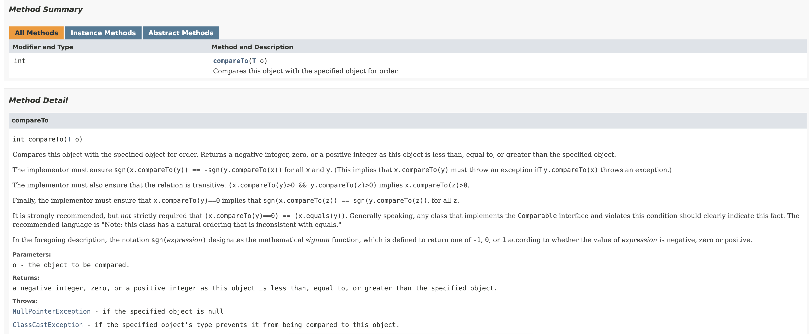

# 모든 객체의 공통 메소드


> 책 "이펙티브 자바 3판"을 공부하면서 정리한 문서입니다.

## 목차

- [모든 객체의 공통 메소드](#모든-객체의-공통-메소드)
  - [목차](#목차)
  - [equals는 일반 규약을 지켜 재정의하라](#equals는-일반-규약을-지켜-재정의하라)
  - [equals를 재정의하려거든 hashcode도 재정의하라](#equals를-재정의하려거든-hashcode도-재정의하라)
  - [toString은 항상 재정의하라](#tostring은-항상-재정의하라)
  - [clone 재정의는 주의해서 진행하라](#clone-재정의는-주의해서-진행하라)
  - [Comparable을 구현할지 고려하라](#comparable을-구현할지-고려하라)

이번 장에서는 Java의 클래스의 최상위 클래스 Object의 메서드들과 Comparable의 compareTo 메서드를 언제, 어떻게 구현하는지에 대해 공부한다.

Object의 명세는 다음과 같다.


이 중 우리가 공부할 메서드는 다음과 같다.

* equals
* hashcode
* toString
* clone

Comparable 인터페이스는 Object의 공통 메소드들과 성격이 유사하다. 따라서, 같이 공부한다. 명세는 다음과 같다.




## equals는 일반 규약을 지켜 재정의하라

책에서는 다음 상황 중 하나라도 부합한다면, equals 재정의를 하지 않는 것을 권장한다.

1. 각 인스턴스가 본질적으로 고유하다. 예) Thread, 값이 아닌 동작하는 객체를 표현하는 클래스일 때.
2. 인스턴스의 논리적 동치성을 검사할 일이 없다. 예외) java.util.regex.Pattern
3. 상위 클래스에서 재정의한 equals가 하위 클래스에도 딱 들어맞는다. ex) List, Set 등 구현체들, 이들은 AbstractList, AbstractSet 등의 equals를 쓴다.
4. 클래스가 private, pacakge-private이고 equals를 호출할 일이 없다. 

이러한 경우 상속 시, equals 재정의를 막는 방법은 다음과 같다.

```java
public class Example {
    @Override
    public boolean equals(Object o) {
        throw new AssertionError();
    }
}
```

그럼 언제 이를 재정의해야할까? 바로 "값 클래스"처럼 논리적 동치성을 확인해야 할 때 재정의한다. 예를 들어 Integer, String 처럼 값을 나타내는 클래스들을 상속할 때이다.

예외) 
1. 값이 같은 인스턴스가 2개 이상 발생하지 않음을 보장하는, 인스턴스 통제 클래스
2. Enum 클래스

다음은 Object 명세에 적힌 규약이다.

"equals" 메소드는 도치 관계를 구현하며, 다음을 만족한다.

* 반사성 : x.equals(x) == true
* 대칭성 : x.equals(y) == y.eqauls(x)
* 추이성 : x.equals(y) == true, y.equals(z) = true, then x.equals(z) == true
* 일관성 : x.equals(y)는 항상 같은 값
* Not NULL : x.equals(null) == false

한 번 예를 들어보자. 다음 코드의 문제는 무엇일까?

```java
public final class CaseInsensitiveString {
    private final String s;

    public CaseInsensitiveString(String s) {
        this.s = Objects.requireNonNull(s);
    }

    @Override
    public boolean equals(Object o) {
        if (o instanceof CaseInsensitiveString) {
            return s.equalsIgnoreCase(((CaseInsensitiveString)o).s);
        }
        if (o instanceof String) {
            return s.equalsIgnoreCase((String) o);
        }
        return false;
    }
}
```

이 경우, 대칭성에 대해 만족하지 않는다. 왜냐하면 다음의 예를 살펴보자.

```java
public class Item10Test {
    // ...
    @Test
    @DisplayName("동치성 테스트 - 대칭성")
    public void test02() {
        CaseInsensitiveString cis = new CaseInsensitiveString("Polish");
        String s = "polish";
        assertTrue(cis.equals(s));
        assertFalse(s.equals(cis));
    }
}
```

개발자는 String 클래스와 CaseInsensitiveString 클래스가 논리적 동치성을 만족하길 원했지만, 이렇게 짜면 String 클래스는 CaseInsensitiveString 클래스의 존재를 모르기 때문에, `String.equals(CaseInsensitiveString)` 는 항상 false의 결과를 얻는다. 동치성을 판단할 때는 **그 클래스간 동치성**만을 판단하는 것이 권장된다. 즉 CaseInsensitiveString 클래스의 eqauls 메서드는 다음과 같이 변경된다.

```java
public final class CaseInsensitiveString {
    private final String s;

    public CaseInsensitiveString(String s) {
        this.s = Objects.requireNonNull(s);
    }

    @Override
    public boolean equals(Object o) {
        if (o == null) {
            return false;
        }

        if (o == this) {
            return true;
        }

        if (!(o instanceof CaseInsensitiveString)) {
            return false;
        }

        CaseInsensitiveString cis = (CaseInsensitiveString) o;
        return cis.s.equalsIgnoreCase(this.s);
    }
}
```

테스트의 예도 다음과 같이 변경된다.

```java
public class Item10Test {
    // ...

    @Test
    @DisplayName("동치성 테스트 - 대칭성")
    public void test02() {
        CaseInsensitiveString cis1 = new CaseInsensitiveString("Polish");
        CaseInsensitiveString cis2 = new CaseInsensitiveString("polish");
        assertEquals(cis1, cis2);
        assertEquals(cis2, cis1);
    }
}
```

테스트 코드를 보면 무사히 통과하는 것을 확인할 수 있다. 5가지 규약에 대한 테스트 코드는 다음과 같다.

```java
public class Item10Test {
    @Test
    @DisplayName("동치성 테스트 - 반사성")
    public void test01() {
        CaseInsensitiveString cis = new CaseInsensitiveString("test");
        assertEquals(cis, cis);
    }

    @Test
    @DisplayName("동치성 테스트 - 대칭성")
    public void test02() {
        CaseInsensitiveString cis1 = new CaseInsensitiveString("Polish");
        CaseInsensitiveString cis2 = new CaseInsensitiveString("polish");
        assertEquals(cis1, cis2);
        assertEquals(cis2, cis1);
    }

    @Test
    @DisplayName("동치성 테스트 - 추이성")
    public void test03() {
        CaseInsensitiveString cis1 = new CaseInsensitiveString("Polish");
        CaseInsensitiveString cis2 = new CaseInsensitiveString("polish");
        CaseInsensitiveString cis3 = new CaseInsensitiveString("poLIsh");
        assertEquals(cis1, cis2);
        assertEquals(cis2, cis3);
        assertEquals(cis1, cis3);
    }

    @Test
    @DisplayName("동치성 테스트 - 일관성")
    public void test04() {
        CaseInsensitiveString cis1 = new CaseInsensitiveString("Polish");
        CaseInsensitiveString cis2 = new CaseInsensitiveString("polish");

        for (int i=0; i<100; i++) {
            assertEquals(cis1, cis2);
        }
    }

    @Test
    @DisplayName("동치성 테스트 - Not NULL")
    public void test05() {
        CaseInsensitiveString cis = new CaseInsensitiveString("Polish");
        assertNotEquals(null, cis);
    }
}
```

이렇게 equals 메소드를 재정의한 클래스의 필드/메소드로는 부족해서 이 클래스를 상속해야 할 때가 있다. 이 경우, 상속 보다는 "컴포지션"을 이용하는 것이 좋다. 왜냐하면, 상속의 경우, 결국 equals 규약을 깨거나 혹은 객체 지향적 추상화의 이점을 포기해야 하기 때문이다. equals를 구현하는 단계는 다음과 같다.

1. == 연산자를 사용하여, 입력이 자기 자신의 참조인지 확인한다.
2. instanceof 연산자로 입력이 올바른 타입인지 확인한다.
3. 입력을 올바른 타입으로 형변환한다.
4. 입력 객체와 자기 자신의 대응되는 핵심 필드들이 모두 일치하는지 확인한다.

우리가 구현한 CaseInsensitiveString 클래스의 equals 메소드는 이를 충실히 따르고 있다.

```java
public final class CaseInsensitiveString {
    // ...

    @Override
    public boolean equals(Object o) {
        // 1단계
        if (o == null) {
            return false;
        }

        if (o == this) {
            return true;
        }
        
        // 2단계
        if (!(o instanceof CaseInsensitiveString)) {
            return false;
        }
        // 3단계
        CaseInsensitiveString cis = (CaseInsensitiveString) o;
        // 4 단계
        return cis.s.equalsIgnoreCase(this.s);
    }
}
```

## equals를 재정의하려거든 hashcode도 재정의하라

## toString은 항상 재정의하라

## clone 재정의는 주의해서 진행하라

## Comparable을 구현할지 고려하라
